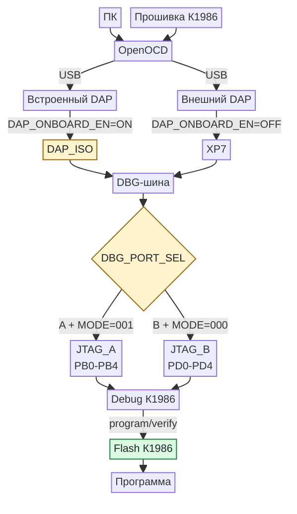
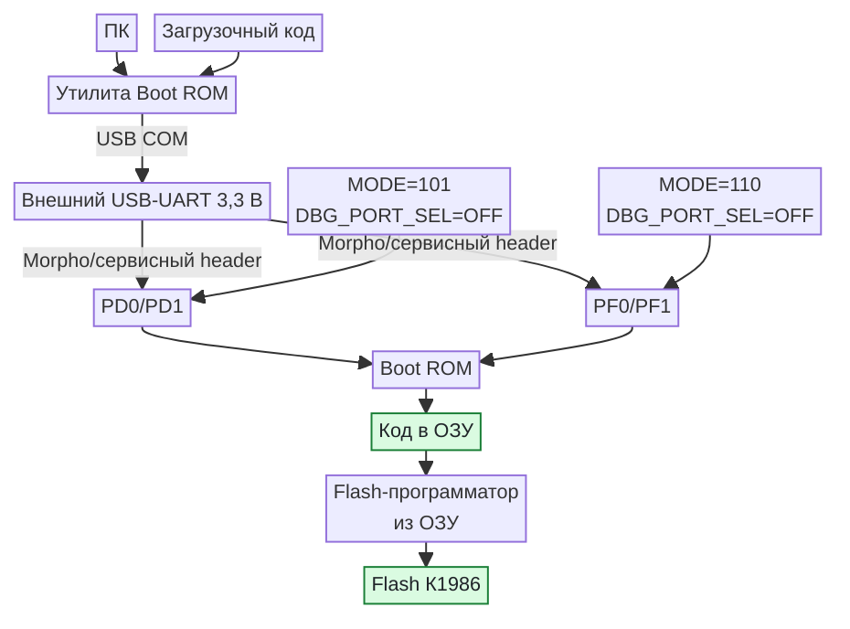
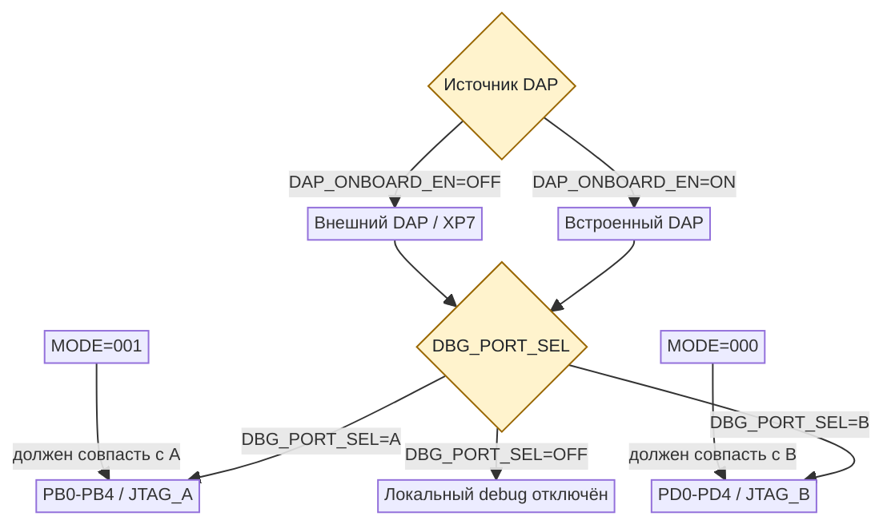
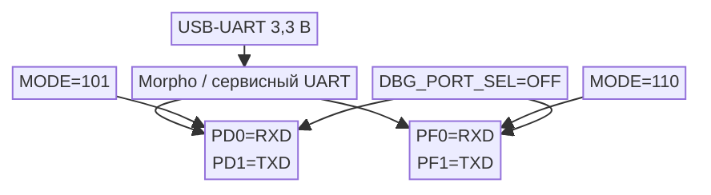

# Замена встроенного ST-Link на CMSIS-DAP в MDR32 MILUINO

## 1. Статус документа

Этот документ описывает предлагаемую переработку встроенного отладчика MDR32 MILUINO для работы с CMSIS-DAP и OpenOCD. Это проектное предложение, а не утверждённая принципиальная схема или готовый нетлист.

До выпуска схемы необходимо совместно утвердить:

1. точную модель микроконтроллера встроенного DAP и объём его Flash/RAM;
2. точную реализацию коммутации сохраняемого шестиконтактного XP7;
3. способ коммутации JTAG_A/OFF/JTAG_B;
4. штатное состояние DAP, MODE[2:0] и VCP;
5. необходимость SWO и способ его подключения к К1986ВЕ92FI;
6. допустимую утечку и ёмкость коммутации на аналоговых выводах PD0-PD4.

## 2. Термины и границы задачи

CMSIS-DAP и OpenOCD выполняют разные функции:

- **CMSIS-DAP** - протокол и прошивка USB-отладчика на плате;
- **OpenOCD** - программа на компьютере, которая управляет CMSIS-DAP, ядром Cortex-M3 и Flash-памятью К1986ВЕ92FI;
- **К1986ВЕ92FI** - целевой микроконтроллер;
- **DAP MCU** - отдельный микроконтроллер встроенного программатора, сейчас DD2 семейства STM32F103;
- **VCP** - виртуальный COM-порт между USB и UART целевого МК;
- **VTref** - напряжение целевой стороны, используемое отладчиком как опорный логический уровень. Это не выход питания внешней платы.

Замена ST-Link на OpenOCD не выполняется одной заменой программы на компьютере. На плате должен находиться совместимый USB-адаптер, в данном случае CMSIS-DAP, а OpenOCD должен иметь подходящую конфигурацию target и Flash для К1986ВЕ92FI.

## 3. Исходная реализация

Источники:

- [принципиальная схема ДФТВ.434519.003Э3](../datasheets/ДФТВ.434519.003Э3.pdf), лист 2;
- [паспорт ДФТВ.434519.003ПС](../datasheets/ДФТВ.434519.003ПС.pdf), страницы PDF 8-9;
- [спецификация К1986ВЕ92FI](../datasheets/К1986ВЕ92FI,%20К1986ВЕ92F1I,%20К1986ВЕ94GI.pdf), страницы PDF 74-76, таблицы 12 и 13.

### 3.1. Текущая структура

```text
USB mini-B XS5
      |
      v
STM32F103 DD2 с прошивкой ST-Link
      |
      +---- XP7: выход встроенного ST-Link на внешнюю target-плату
      |
      +---- XP8: две перемычки SWCLK и SWDIO
                    |
                    v
              К1986ВЕ92FI, PD1/PD0, JTAG_B/SWD
```

DD2 одновременно обслуживает:

- USB-интерфейс встроенного ST-Link;
- SWD целевого микроконтроллера;
- UART/VCP;
- светодиод состояния;
- BOOT0 и служебные точки собственного программирования.

### 3.2. XP7

Текущий XP7 - шестиконтактный выход встроенного ST-Link для внешней целевой платы.

| Контакт | Сигнал | Назначение |
|---:|---|---|
| 1 | VDD_TRG | Опорное напряжение внешней target-платы |
| 2 | SWCLK | Тактовый сигнал SWD |
| 3 | GND | Общий провод |
| 4 | SWDIO | Двунаправленные данные SWD |
| 5 | NRST | Сброс target |
| 6 | SWO | Трассировочный вход встроенного ST-Link |

XP7 не является полноценным JTAG-разъёмом: на нём отсутствуют отдельные TDI, TDO и nTRST. Он также не является безопасным входом внешнего адаптера к установленному К1986ВЕ92FI, потому что остаётся соединён с выходами DD2.

### 3.3. XP8

Текущий XP8 содержит две независимые двухконтактные перемычки.

| Контакты | Соединение |
|---|---|
| 1-2 | `SWCLK` встроенного ST-Link - `SWCLK_TARG` К1986ВЕ92FI |
| 3-4 | `SWDIO` встроенного ST-Link - `SWDIO_TARG` К1986ВЕ92FI |

При замкнутом XP8:

- SWCLK приходит на PD1/JB_TCK, физический вывод 32;
- SWDIO приходит на PD0/JB_TMS, физический вывод 31;
- используется JTAG_B в двухпроводном режиме SWD.

XP8 разрывает только SWCLK и SWDIO. Он не обеспечивает полную изоляцию NRST, SWO, питания и остальных линий JTAG.

### 3.4. Ограничения существующего решения

1. Используется только JTAG_B/SWD на PD0 и PD1.
2. Полный пятисигнальный JTAG к К1986ВЕ92FI не разведён.
3. PD0-PD4 конфликтуют с ADC0-ADC4 и внешней опорой ADC0_REF+/ADC1_REF-.
4. Нет аппаратного выбора JTAG_A/JTAG_B.
5. После снятия XP8 отсутствует полноценный вход внешнего адаптера к установленному target.
6. Подключение внешнего адаптера к XP7 может создать конфликт его выходов с выходами DD2.
7. Нет состояния, в котором все отладочные линии гарантированно электрически отключены от target.
8. Не предусмотрена защита от подпитки выключенного target через отладочные GPIO.
9. MODE[2:0] зафиксированы в `000`, поэтому после включения выбирается JTAG_B.

## 4. Целевая архитектура

### 4.1. Рекомендуемая функциональная схема

```text
                   USB-C DAP
                       |
                       v
              DAP MCU с CMSIS-DAP v2
                       |
                 DAP_ISO, ON/OFF
                       |
        +--------------+---------------+
        |                              |
        v                              v
  XP7, 1x6 SWD                 DBG_PORT_SEL
  внешний адаптер/target          A / OFF / B
                                  + LOCAL_RESET_EN
                                  + LOCAL_VTREF_EN
                                       |
                        +--------------+--------------+
                        |                             |
                        v                             v
                JTAG_A: PB0-PB4               JTAG_B: PD0-PD4

DBG_nRESET -----------------------> RESET К1986 только в A/B
DBG_VTREF <------------------------ локальный VTref только в A/B
MODE[2:0] ------------------------> отдельный механический конфигуратор
```

Существующий шестиконтактный XP7 и его распиновка сохраняются. XP7 подключается к SWD-части общей отладочной шины через управляемую коммутацию, после изоляции встроенного DAP и до селектора локального отладочного порта. Поэтому он может работать в двух направлениях:

- встроенный CMSIS-DAP программирует внешнюю target-плату по SWD, когда локальный селектор установлен в OFF;
- внешний адаптер программирует установленный К1986ВЕ92FI по SWD, когда встроенный DAP отключён.

В положениях A/B к общей шине дополнительно подключаются локальные RESET и VTref. В положении OFF должны разрываться не только пять JTAG-линий, но также локальные RESET и VTref. Иначе при программировании внешней target-платы будут связаны её опорное питание и сброс установленного К1986ВЕ92FI.

Эти режимы должны быть описаны на шелкографии. Одновременное подключение двух активных адаптеров или двух target-плат запрещается.

### 4.2. Состояния коммутации

| Задача | DAP_ONBOARD_EN | DBG_PORT_SEL | MODE[2:0] | XP7 |
|---|---|---|---|---|
| Встроенный DAP - локальный JTAG_A | ON | A | 001 | Свободен |
| Встроенный DAP - локальный JTAG_B | ON | B | 000 | Свободен |
| Внешний DAP - локальный SWD через выводы JTAG_A | OFF | A | 001 | Подключён внешний DAP |
| Внешний DAP - локальный SWD через выводы JTAG_B | OFF | B | 000 | Подключён внешний DAP |
| Встроенный DAP - внешняя target-плата | ON | OFF | Не влияет на внешнюю плату | Подключена внешняя target-плата |
| Изоляция локального target от общей отладочной шины | OFF | OFF | Любое | Свободен |

Запрещённые сочетания:

- `DAP_ONBOARD_EN=ON` при подключённом к XP7 внешнем активном адаптере;
- `DBG_PORT_SEL=A/B` при программировании внешней target-платы встроенным DAP;
- `DBG_PORT_SEL=A` вместе с `MODE=000`;
- `DBG_PORT_SEL=B` вместе с `MODE=001`.

Несоответствие выбранного порта и MODE не должно повреждать плату, но отладочное соединение не установится, а часть пользовательских выводов останется занята внутренней логикой JTAG.

### 4.3. Визуальная схема всех путей загрузки прошивки К1986ВЕ92FI

Следующая схема показывает штатные пути загрузки локального К1986ВЕ92FI. Обновление прошивки самого DAP MCU здесь не показано: оно выполняется отдельно через `DAP_PROG`/SWD или системный загрузчик DAP MCU, как описано в разделе 15.



UART Boot ROM показан отдельно, чтобы JTAG и UART не растягивали одну общую диаграмму:



На схеме важно различать:

- USB CMSIS-DAP передаёт команды OpenOCD встроенному или внешнему отладчику;
- встроенный USB CDC/VCP соединён только с PB6/PB5 и служит терминалом работающей программы;
- заводской UART-загрузчик доступен только через внешний USB-UART 3,3 В на Morpho или сервисном разъёме;
- в MODE=101/110 работает заводской Boot ROM, JTAG при этом заблокирован;
- UART Boot ROM сначала принимает исполняемый код в ОЗУ; запись внутренней Flash выполняется загруженным кодом-программатором, если такой сценарий поддержан утилитой.

### 4.4. Логика механической коммутации



Для UART-загрузчика переключение выполняется независимо:



### 4.5. Таблица переключений для загрузки локального К1986ВЕ92FI

| Способ | Интерфейс от ПК | DAP_ONBOARD_EN | DBG_PORT_SEL | MODE[2:0] | Дополнительные условия |
|---|---|---|---|---|---|
| Встроенный CMSIS-DAP через JTAG_A | USB CMSIS-DAP | ON | A | 001 | Штатный рекомендуемый режим |
| Встроенный CMSIS-DAP через JTAG_B | USB CMSIS-DAP | ON | B | 000 | PD0-PD4 заняты отладкой |
| Внешний DAP через SWD на выводах JTAG_A | USB внешнего DAP, XP7 | OFF | A | 001 | Встроенный DAP обязательно high-Z |
| Внешний DAP через SWD на выводах JTAG_B | USB внешнего DAP, XP7 | OFF | B | 000 | Встроенный DAP обязательно high-Z |
| Boot ROM UART2 через внешний USB-UART и PD0/PD1 | Внешний USB-UART 3,3 В | OFF рекомендуется | OFF | 101 | Morpho/сервисный header; AREF=AUcc; REF_MINUS open; полный power cycle |
| Boot ROM UART2 через внешний USB-UART и PF0/PF1 | Внешний USB-UART 3,3 В | OFF рекомендуется | OFF | 110 | Morpho/сервисный header; PF0/PF1 Arduino/ICSP open; LED D13 open; полный power cycle |

`MODE=010/011` не включены в схему как рабочие пути загрузки: для К1986ВЕ92FI выполнение из внешней памяти недоступно. `MODE=100` зарезервирован, а `MODE=111` является тестовым режимом. Пользовательские bootloader через USB, CAN, SPI и другие интерфейсы также не показаны, поскольку для них сначала должна быть записана собственная программа во Flash.

### 4.6. Программирование внешней target-платы встроенным DAP

XP7 допускает обратный сценарий, который не относится к загрузке локального К1986ВЕ92FI:

```text
ПК -> USB CMSIS-DAP -> встроенный DAP -> XP7 -> внешняя target-плата
```

Для этого:

- `DAP_ONBOARD_EN=ON`;
- `DBG_PORT_SEL=OFF`;
- локальные RESET и VTref отключены через `LOCAL_RESET_EN=OFF` и `LOCAL_VTREF_EN=OFF`;
- VTref поступает с внешней target-платы через XP7;
- внешний активный DAP одновременно к XP7 не подключается.

### 4.7. Органы переключения на плате

| Орган | Предлагаемое физическое исполнение | Что переключает | Примечание |
|---|---|---|---|
| MODE[2:0] | Три механических 0/1 конфигуратора или джампера | PF4/MODE0, PF5/MODE1, PF6/MODE2 | Новое состояние применяется только после полного power cycle Ucc target |
| DAP_ONBOARD_EN | Джампер, переключатель или OE аппаратного изолятора | Соединение встроенного DAP с общей DBG-шиной | OFF обязателен при подключении внешнего активного DAP |
| DBG_PORT_SEL | A/OFF/B: группы мостов, многополюсный переключатель либо электронный mux | Пять линий JTAG, LOCAL_RESET_EN и LOCAL_VTREF_EN | Положение должно совпадать с MODE=001/000 |
| SEL_AREF | Механический селектор или мосты | AUcc либо PD0/ADC0_REF+ на Arduino AREF | Для MODE=101 выбрать AUcc |
| SB_REF_MINUS | Normally-open bridge | PD1/ADC1_REF- к AGND | Для MODE=101 обязательно open |
| SB_PF0_ARD/SB_PF1_ARD | Normally-closed либо конфигурационные bridges по принятому default-профилю | PF0/PF1 к Arduino/ICSP | Для MODE=110 обязательно open |
| SB_LED_D13 | Разрывной bridge | LED_BUILTIN к PF1/D13 | Для MODE=110 рекомендуется open |
| UART Boot service | Morpho либо отдельная колодка 1x6 | GND, +3V3_TARGET, PD0, PD1, PF0, PF1 | Только для внешнего USB-UART с логическими уровнями 3,3 В |

Физический тип `DBG_PORT_SEL` пока не утверждён. Для первого прототипа мосты дают минимальные утечку и ёмкость; механический переключатель удобнее пользователю; электронный mux требует проверки аналоговых характеристик PD0-PD4 и поведения при выключенном target.

## 5. Замена DD2

Существующий DD2 STM32F103 необходимо заменить новым DAP MCU, рассчитанным на работу с CMSIS-DAP v2 и CDC ACM/VCP.

Новый микроконтроллер должен иметь:

- USB Device для CMSIS-DAP v2 и CDC;
- достаточный объём Flash и RAM для обеих функций;
- GPIO для полного JTAG: TCK, TMS/SWDIO, TDI, TDO и nTRST, а также nRESET и опционального SWO;
- отдельный интерфейс первичной прошивки и восстановления `DAP_PROG`;
- предсказуемое high-Z состояние отладочных выводов при сбросе и выключенном питании target.

Замена DD2 требует переработать его питание, USB-обвязку, тактирование, цепи загрузки и производственного программирования. Конкретную модель нового DAP MCU необходимо утвердить отдельно.

## 6. Требования к прошивке CMSIS-DAP

В прошивке должны быть реализованы:

1. CMSIS-DAP v2 через USB bulk;
2. JTAG и SWD transports;
3. управление nRESET;
4. перевод всех отладочных выходов в безопасное состояние при старте, USB disconnect и ошибке;
5. корректное описание возможностей через команды DAP_Info;
6. уникальный USB serial number;
7. CDC ACM/VCP, если он сохраняется;
8. светодиоды USB/DAP activity;
9. ограничение начальной частоты JTAG/SWD до заведомо устойчивого значения;
10. отдельный режим обновления и восстановления прошивки DAP MCU.

CMSIS-DAP v1 через HID можно оставить как резерв совместимости, но для OpenOCD основной режим целесообразно строить на CMSIS-DAP v2 bulk.

## 7. Полная отладочная шина

### 7.1. Обязательные сигналы

| Сеть общей шины | Направление относительно DAP | JTAG_A К1986 | JTAG_B К1986 | Примечание |
|---|---|---|---|---|
| DBG_TCK | DAP -> target | PB2, вывод 45 | PD1, вывод 32 | В SWD используется как SWCLK |
| DBG_TMS_SWDIO | Двунаправленный в SWD | PB1, вывод 44 | PD0, вывод 31 | В JTAG DAP -> target как TMS |
| DBG_TDI | DAP -> target | PB3, вывод 46 | PD3, вывод 34 | Нужен для полного JTAG |
| DBG_TDO | target -> DAP | PB0, вывод 43 | PD4, вывод 30 | Нужен для полного JTAG |
| DBG_nTRST | DAP -> target | PB4, вывод 47 | PD2, вывод 33 | Активный низкий уровень |
| DBG_nRESET | DAP -> target | RESET, вывод 18 | RESET, вывод 18 | Общий для A/B, open-drain; отключается от локального target в OFF |
| DBG_VTREF | target -> DAP | +3V3_TARGET | +3V3_TARGET | Только опорный уровень; локальный VTref отключается в OFF |
| GND | Общий | GND | GND | Несколько контактов на внешнем разъёме |
| DBG_SWO | target -> DAP | Требует проверки | Требует проверки | Опционально; нельзя автоматически считать его эквивалентом TDO |

### 7.2. Подтяжки и последовательные резисторы

Спецификация К1986ВЕ92FI требует подтяжки линий JTAG к питанию сопротивлениями не менее 10 кОм и показывает типовую сеть 100 кОм. Для новой платы предлагается:

- установить переключаемые подтяжки 100 кОм на общей стороне `DBG_PORT_SEL`, чтобы они действовали только на выбранный JTAG-порт;
- не оставлять постоянные подтяжки на PD0-PD4, когда JTAG_B отключён, поскольку эти выводы используются АЦП и внешней опорой;
- предусмотреть посадочные места последовательных резисторов 22-47 Ом у активного драйвера DAP;
- окончательные номиналы выбрать после проверки фронтов и устойчивой частоты JTAG.

Подтяжка RESET должна оставаться на target-стороне независимо от выбранного JTAG-порта.

## 8. Изоляция встроенного DAP

`DAP_ISO` должен переводить встроенный DAP в высокоимпедансное состояние. Простого выключения прошивки или перевода GPIO STM32 в input недостаточно как единственного средства защиты.

Требования к элементам изоляции:

- поддержка двунаправленного SWDIO;
- корректные направления TCK/TMS/TDI/nTRST и TDO;
- гарантированный high-Z при `DAP_ONBOARD_EN=OFF`;
- `Ioff` или эквивалентная защита при выключенном target;
- отсутствие подпитки target через защитные диоды;
- питание/разрешение с учётом DBG_VTREF;
- рабочий диапазон не менее 0-3,3 В;
- достаточная полоса для выбранной частоты JTAG/SWD.

Возможны два решения:

1. отдельные направленные трёхстабильные буферы плюс двунаправленный элемент для SWDIO;
2. банк двунаправленных аналоговых ключей с гарантированным `Ioff`.

Второй вариант проще для совмещённой линии TMS/SWDIO, но требует проверки сопротивления, утечки и паразитной ёмкости.

`DBG_nRESET` должен формироваться open-drain либо через отдельный транзистор. Это позволяет совместно использовать кнопку RESET, встроенный DAP, shield и внешний адаптер без конфликта выходов. Между общей отладочной шиной и RESET локального К1986 должен находиться `LOCAL_RESET_EN`: он включён в A/B и выключен в OFF.

Опорный уровень изолятора должен браться с `DBG_VTREF`. В локальных режимах A/B эта сеть соединяется с `+3V3_TARGET` через `LOCAL_VTREF_EN`; в режиме работы с внешней target локальный VTref отключён, а уровень приходит с XP7.

## 9. Коммутация JTAG_A/OFF/JTAG_B

Селектор должен одновременно переключать пять сигналов: TCK, TMS/SWDIO, TDI, TDO и nTRST. Кроме того, его состояние должно управлять двумя общими ключами `LOCAL_RESET_EN` и `LOCAL_VTREF_EN`: они замкнуты в A/B и разомкнуты в OFF.

### 9.1. Вариант 1 - группы solder bridge/0 Ом

Предусмотреть:

- пять мостов `DBG_A_*`;
- пять мостов `DBG_B_*`;
- запрет одновременной установки групп A и B;
- отдельный `DAP_ONBOARD_EN`.

Преимущества:

- минимальная утечка и ёмкость;
- наилучшая точность аналоговых измерений на PD0-PD4;
- простая диагностика осциллографом.

Недостатки:

- неудобно часто менять порт;
- нет аппаратной защиты от одновременной установки обеих групп;
- требуется перепайка или перестановка нескольких перемычек.

### 9.2. Вариант 2 - электронный A/OFF/B

Используется банк двунаправленных ключей/мультиплексоров с общим механическим управляющим переключателем.

Преимущества:

- быстрое переключение;
- можно обеспечить аппаратно взаимоисключающие A/OFF/B;
- удобная пользовательская маркировка.

Недостатки:

- утечка и ёмкость ключей остаются критичными для PD0-PD4;
- требуется корректное поведение при разной последовательности включения доменов питания;
- возрастает количество компонентов.

### 9.3. Вариант 3 - многополюсный механический переключатель

Даёт физический разрыв без полупроводниковой утечки, но пятиканальный трёхпозиционный переключатель крупный, дорогой и может иметь неудобную механику.

Для первого прототипа с приоритетом аналоговой точности рекомендуется вариант с группами мостов. Для пользовательской серийной платы удобнее электронный A/OFF/B после измерения его влияния на АЦП.

## 10. MODE[2:0]

MODE0, MODE1 и MODE2 находятся соответственно на PF4, PF5 и PF6, физических выводах 6, 7 и 8.

Предлагаемая реализация:

- три независимых механических конфигуратора 0/1;
- определённые внешние pull-down для штатного состояния;
- возможность подать логическую 1 через переключатель и резистор к +3,3 В;
- тестовые точки на всех MODE;
- вывод PF4-PF6 на Morpho без прямого соединения с другими активными источниками;
- таблица режимов на шелкографии.

Критичные режимы:

| MODE[2:0] | Запуск | Активный JTAG | Последствия |
|---|---|---|---|
| 000 | Внутренняя Flash | JTAG_B | PD0-PD4 заняты отладкой |
| 001 | Внутренняя Flash | JTAG_A | PD0-PD7 доступны аналоговой подсистеме |
| 101 | UART2 loader | Нет JTAG | PD0/PD1 заняты UART-загрузчиком |
| 110 | UART2 loader | Нет JTAG | PF0/PF1 заняты UART-загрузчиком |
| 111 | Тестовый режим | JTAG_A TAP | Не использовать как штатный режим |

Состояние MODE учитывается только при первоначальном включении. После установки FPOR обычного RESET недостаточно: для применения нового положения MODE необходимо полностью отключить основное питание Ucc К1986ВЕ92FI и включить его снова.

Следовательно, на плате нужен доступный `TARGET_POWER` либо другой способ гарантированно разорвать все источники питания target, включая USB target, питание от DAP USB, VIN и внешние разъёмы.

Предлагаемый штатный профиль для обсуждения:

- `MODE=001`;
- `DBG_PORT_SEL=A`;
- `DAP_ONBOARD_EN=ON`.

Он освобождает PD0-PD4 для AREF и аналоговых контактов, но занимает PB0-PB4 интерфейсом JTAG_A.

## 11. Сохраняемый XP7

Форм-фактор, количество контактов и распиновка существующего XP7 сохраняются:

| Контакт | Сигнал | Назначение |
|---:|---|---|
| 1 | VTref/VDD_TRG | Опорный уровень активной target-стороны |
| 2 | SWCLK | Тактовый сигнал SWD |
| 3 | GND | Общий провод |
| 4 | SWDIO | Двунаправленные данные SWD |
| 5 | nRESET | Сброс target |
| 6 | SWO | Опциональная трассировка от target к DAP |

XP7 остаётся шестиконтактным SWD-разъёмом. Выводы TDI, TDO и nTRST на него не добавляются; полный четырёхпроводный JTAG через XP7 не поддерживается.

Перерабатывается только внутренняя коммутация XP7. Она должна обеспечивать два режима:

1. встроенный CMSIS-DAP программирует внешнюю target-плату по SWD, локальная отладочная ветвь отключена;
2. внешний DAP программирует локальный К1986ВЕ92FI по SWD, встроенный DAP аппаратно переведён в high-Z.

Коммутация должна исключать одновременное подключение двух активных DAP или двух target-плат. Для локального К1986 через XP7 должны корректно передаваться SWCLK, SWDIO, nRESET и локальный VTref. Использование SWO зависит от подтверждения соответствующего вывода и режима К1986ВЕ92FI.

VTref на XP7 используется только как опорный логический уровень: от внешней target к встроенному DAP либо от локального target к внешнему DAP. Питание внешней target-платы через XP7 не предусматривается.

## 12. Замена XP8

Текущий четырёхконтактный XP8 следует заменить узлом `DBG_PORT_SEL`.

Он должен:

- переключать все пять сигналов JTAG;
- иметь состояние OFF;
- не соединять A и B одновременно;
- не оставлять подтяжки на невыбранном порту;
- подключать RESET локального К1986 к общей шине только в A/B;
- подключать локальный VTref к общей шине только в A/B;
- быть независимым от `DAP_ONBOARD_EN`;
- иметь понятные обозначения `A`, `OFF`, `B`.

nRESET не переключается между портами A и B, поскольку это отдельный общий вывод К1986ВЕ92FI. Но он должен отключаться от локального target в положении OFF и от встроенного DAP при `DAP_ONBOARD_EN=OFF`.

Аналогично, `+3V3_TARGET` нельзя постоянно соединять с VTref контактом XP7. В положении OFF контакт XP7 должен принимать VTref внешней target-платы, не связывая два источника 3,3 В.

## 13. USB и питание DAP

### 13.1. USB-C вместо XS5 mini-B

Для USB-C в роли USB Device необходимо:

- отдельные Rd 5,1 кОм на CC1 и CC2;
- ESD-защита D+ и D- с малой ёмкостью;
- посадочные места согласующих последовательных резисторов согласно требованиям выбранного DAP MCU;
- отсутствие длинных ответвлений на D+/D-;
- дифференциальная трассировка около 90 Ом;
- определённая схема подключения экрана разъёма;
- защита VBUS и исключение обратной подачи 5 В.

### 13.2. Домены питания

Рекомендуется разделить:

- `+3V3_DAP` - питание DAP MCU от USB-C DAP;
- `+3V3_TARGET` - питание К1986ВЕ92FI;
- `DBG_VTREF` - переключаемый опорный уровень: +3V3_TARGET в локальных режимах либо VTref с XP7 при работе с внешней target;
- `+5V_USB_DAP` - VBUS разъёма DAP;
- остальные источники target: VIN, USB target, внешнее питание.

DAP может оставаться включённым при выключенном target. Поэтому все сигналы между доменами должны иметь предсказуемое состояние и не должны подпитывать `+3V3_TARGET`.

Существующий XP4 выбора питания необходимо переработать с учётом двух USB-C и внешнего VIN. Для корректного чтения MODE нужен настоящий разрыв основного Ucc target, а не только RESET.

## 14. VCP и внешний UART-загрузчик

CMSIS-DAP может сохранить CDC ACM VCP, но он используется только как терминал работающей программы на PB6/PB5. К выводам заводского UART-загрузчика встроенный VCP не подключается.

### 14.1. Обычный VCP

Соединения относительно К1986ВЕ92FI:

- `DAP_VCP_TX` -> PB6/UART1_RXD, вывод 51;
- PB5/UART1_TXD, вывод 50 -> `DAP_VCP_RX`.

PB6/PB5 одновременно соответствуют Arduino D0/D1, поэтому VCP и shield UART должны подключаться взаимоисключающими мостами. Этот канал сам по себе не запускает и не обслуживает заводской Boot ROM.

### 14.2. Внешний USB-UART для Boot ROM

Оба заводских варианта UART2 доступны через Morpho либо отдельную сервисную колодку:

| MODE[2:0] | RXD К1986 | TXD К1986 |
|---|---|---|
| 101 | PD0/UART2_RXD, вывод 31 | PD1/UART2_TXD, вывод 32 |
| 110 | PF0/UART2_RXD, вывод 2 | PF1/UART2_TXD, вывод 3 |

Подключение выполняется перекрёстно: TX адаптера -> RXD К1986, RX адаптера <- TXD К1986, GND адаптера -> GND платы. Допустим только USB-UART с логическими уровнями 3,3 В; RS-232 и адаптер с уровнями 5 В подключать нельзя.

Специальный UART-мультиплексор на плате не требуется. Для удобства можно поставить компактную колодку `GND, +3V3_TARGET, PD0, PD1, PF0, PF1`; вывод `+3V3_TARGET` здесь предназначен прежде всего как опорный уровень, а питание платы от адаптера должно быть явно запрещено либо отдельно защищено от обратного тока.

### 14.3. Загрузчик MODE=101 на PD0/PD1

Требуемое состояние:

```text
MODE[2:0] = 101
DBG_PORT_SEL = OFF
SEL_AREF = AUcc, а не PD0
SB_REF_MINUS = OPEN
```

PD0/PD1 одновременно используются как ADC0_REF+/ADC1_REF-, аналоговые входы и TMS/TCK JTAG_B. Перед загрузкой необходимо отключить PD0 от Arduino AREF, разомкнуть PD1-AGND, исключить внешние активные сигналы и подключить внешний USB-UART к PD0/PD1. После установки MODE нужно полностью выключить и снова включить Ucc target.

Постоянные UART-подтяжки и иные элементы загрузчика на PD0/PD1 ставить не следует: они ухудшат аналоговый режим. Эти выводы также не являются 5-вольт-совместимыми.

### 14.4. Загрузчик MODE=110 на PF0/PF1

Требуемое состояние:

```text
MODE[2:0] = 110
DBG_PORT_SEL = OFF
SB_PF0_ARD = OPEN
SB_PF1_ARD = OPEN
SB_LED_D13 = OPEN
```

| Вывод | UART-загрузчик | Обычная функция платы |
|---|---|---|
| PF0 | UART2_RXD | D11/MOSI, ICSP COPI |
| PF1 | UART2_TXD | D13/SCK, ICSP SCK, LED_BUILTIN |

Перед загрузкой нужно снять shield либо разомкнуть PF0/PF1 от Arduino/ICSP, отключить LED от PF1, подключить внешний USB-UART, установить MODE=110 и выполнить полный power cycle Ucc target.

### 14.5. Согласованная архитектура

- узлы маршрутизации встроенного VCP на PD0/PD1 и PF0/PF1 не устанавливаются;
- встроенный VCP остаётся обычным терминалом на PB6/PB5;
- обе пары заводского UART-загрузчика доступны только через Morpho или сервисную колодку;
- MODE[2:0] задаётся независимо механическими конфигураторами;
- при UART-загрузке `DBG_PORT_SEL` устанавливается в OFF;
- после любого изменения MODE выполняется полный power cycle основного Ucc target;
- параметры протокола Boot ROM, последовательность обмена и формат загружаемого кода должны быть отдельно подтверждены по спецификации и выбранной утилите.

В инструкции пользователя следует явно привести таблицу состояний MODE и конфликтующих мостов. Внешний USB-UART является только физическим преобразователем USB-UART, а не JTAG-программатором.

### 14.6. Дополнительные функции DAP

- SWO capture - только после подтверждения вывода SWO К1986ВЕ92FI;
- MCO от DAP MCU на OSC_IN target - через отдельный bridge и только как один из взаимоисключающих источников тактирования;
- USB Mass Storage/DAPLink - не включать без отдельного требования.

## 15. Программирование самого DAP MCU

На плате должен быть отдельный служебный разъём `DAP_PROG`:

- DAP_SWDIO;
- DAP_SWCLK;
- DAP_nRESET;
- +3V3_DAP;
- GND.

Также следует сохранить доступ к BOOT0 и штатному системному загрузчику DAP MCU. Служебные сигналы DAP MCU нельзя смешивать с JTAG/SWD целевого К1986ВЕ92FI.

Первичное программирование и восстановление DAP должны работать даже при полностью отключённом target.

## 16. Предлагаемые имена сетей

| Группа | Имена |
|---|---|
| USB DAP | USB_DAP_DP, USB_DAP_DN, USB_DAP_VBUS, USB_DAP_CC1, USB_DAP_CC2 |
| DAP до изолятора | DAP_TCK, DAP_TMS_SWDIO, DAP_TDI, DAP_TDO, DAP_nTRST, DAP_nRESET, DAP_SWO |
| Общая шина | DBG_TCK, DBG_TMS_SWDIO, DBG_TDI, DBG_TDO, DBG_nTRST, DBG_nRESET, DBG_VTREF |
| JTAG_A | JA_TCK, JA_TMS, JA_TDI, JA_TDO, JA_nTRST |
| JTAG_B | JB_TCK, JB_TMS, JB_TDI, JB_TDO, JB_nTRST |
| Управление | DAP_ONBOARD_EN, DBG_SEL_A, DBG_SEL_B, DBG_SEL_OFF, LOCAL_RESET_EN, LOCAL_VTREF_EN |
| Питание | +3V3_DAP, +3V3_TARGET, DBG_VTREF, +5V_USB_DAP |
| Обычный VCP | DAP_VCP_TX, DAP_VCP_RX, VCP_RX_PB6, VCP_TX_PB5 |
| UART Boot service | UART2_RX_PD0, UART2_TX_PD1, UART2_RX_PF0, UART2_TX_PF1 |

Единая терминология уменьшит риск случайного соединения линий DD2 и К1986 при переносе схемы между листами.

## 17. Изменения по узлам существующей платы

| Существующий узел | Предлагаемое изменение |
|---|---|
| DD2 STM32F103 | Сохранить для прототипа только после проверки точной модификации; прошивка CMSIS-DAP v2 + опциональный CDC |
| XS5 mini-B | Заменить на USB-C Device с CC, ESD и защитой VBUS |
| XP7 | Сохранить существующий 1x6 и распиновку; добавить безопасную двунаправленную SWD-коммутацию, изоляцию встроенного DAP и переключение VTref/nRESET |
| XP8 | Заменить селектором пяти линий JTAG_A/OFF/JTAG_B и ключами локальных RESET/VTref |
| SWCLK/SWDIO DD2 | Включить через DAP_ISO, а не напрямую в общую шину |
| NRST target | Open-drain от DAP; раздельные ветви кнопки, shield и внешнего адаптера |
| XP9/BOOT0 DD2 | Сохранить либо заменить явным узлом DAP_BOOT/DAP_PROG |
| XP4 питание | Переработать для раздельных DAP/target доменов и полного power cycle target |
| XP3/UART | Сохранить или переработать как сервисный header внешнего USB-UART; встроенный VCP к PD0/PD1 и PF0/PF1 не подключать |
| HL5 ST-Link | Переименовать в DAP_STATUS/USB_ACTIVITY |
| MODE0-MODE2 | Убрать постоянное `000`; добавить механический конфигуратор и тестовые точки |
| PB0-PB4 | Подключать к общей шине только при выборе JTAG_A; сохранить доступ на Morpho |
| PD0-PD4 | Подключать к общей шине только при выборе JTAG_B; в режиме A не нагружать аналоговые цепи |
| PB5/PB6 UART/VCP | Оставить только обычный терминал через взаимоисключающие мосты с Arduino D1/D0 |
| PD0/PD1 analog reference | Сохранить SEL_AREF и разрывной SB_REF_MINUS; обеспечить освобождение для MODE=101 |
| PF0/PF1 Arduino/ICSP | Добавить SB_PF0_ARD и SB_PF1_ARD для режима MODE=110 |

## 18. Требования к разводке печатной платы

1. USB D+/D- вести парой с постоянной геометрией и непрерывной землёй.
2. ESD-защиту USB разместить у разъёма, последовательные резисторы - согласно рекомендации производителя DAP MCU.
3. Изолятор DAP и селектор A/B разместить ближе к источнику/точке разветвления, не создавать длинных параллельных ответвлений.
4. TCK вести наиболее аккуратно; предусмотреть рядом GND и минимизировать петлю возвратного тока.
5. Не проводить TCK и USB над разрывами опорной земли.
6. Не вести JTAG_B рядом с AREF и высокоомными аналоговыми цепями на большой длине.
7. Разместить тестовые точки на общей шине и на обеих сторонах селектора.
8. Обеспечить визуальный доступ к положению MODE, DAP_ONBOARD_EN и DBG_PORT_SEL.
9. На шелкографии напечатать допустимые сочетания `A+001` и `B+000`.
10. Предупредить: `MODE change -> target power OFF/ON`.
11. У сервисного UART-разъёма ясно обозначить направления RX/TX относительно К1986, разместить рядом GND и маркировку `3V3 ONLY`.
12. Не добавлять на PD0/PD1 постоянные UART-подтяжки и иные элементы, нагружающие чувствительную аналоговую ветвь.

Начальную частоту OpenOCD следует ограничить, затем поднимать после измерения качества сигналов. Максимальную частоту нельзя назначать только по возможностям CMSIS-DAP MCU.

## 19. OpenOCD

OpenOCD должен использовать драйвер `cmsis-dap` и транспорт `jtag` либо `swd`.

Минимальный каркас конфигурации:

```tcl
adapter driver cmsis-dap
transport select jtag
adapter speed 1000

# Здесь должен подключаться проверенный target-файл К1986ВЕ92FI.
# source [find target/<k1986ve92fi>.cfg]
```

Для SWD:

```tcl
adapter driver cmsis-dap
transport select swd
adapter speed 1000
```

OpenOCD поддерживает адаптеры CMSIS-DAP и содержит Flash-драйвер Milandr, но это не гарантирует готовность конкретной board/target-конфигурации К1986ВЕ92FI. До фиксации программной части надо проверить:

- обнаружение TAP/DP;
- правильный IDCODE;
- halt/resume/step;
- управление reset;
- чтение Flash;
- erase/program/verify;
- поведение при защищённой или повреждённой Flash;
- восстановление через JTAG_A и JTAG_B;
- работу на актуальной сборке OpenOCD, используемой в проекте.

Нельзя копировать target-конфигурацию другого Milandr без проверки размеров Flash, адресов контроллера, алгоритма стирания и reset sequence.

## 20. План проверки прототипа

### 20.1. Проверка без К1986ВЕ92FI

1. Проверить все напряжения DAP и отсутствие перегрева.
2. Проверить USB enumeration CMSIS-DAP v2.
3. Проверить уникальный serial number.
4. Проверить CDC/VCP, если включён.
5. Проверить обновление DAP через DAP_PROG/BOOT0.
6. Измерить уровни всех отладочных выводов при DAP_ONBOARD_EN=OFF.

### 20.2. Проверка питания и изоляции

1. DAP ON, target OFF: ток через VTref и сигнальные линии должен быть пренебрежимо мал.
2. DAP OFF, target ON: на DAP-сетях не должно быть паразитного питания.
3. Внешний DAP, встроенный DAP OFF: отсутствие конфликта выходов.
4. `DBG_PORT_SEL=OFF`: отсутствие электрической нагрузки на PB0-PB4 и PD0-PD4 в пределах требований.
5. `DBG_PORT_SEL=OFF`: RESET и +3V3 локального target не должны выходить на XP7.
6. Проверить все источники target и возможность настоящего power cycle для MODE.

### 20.3. Проверка JTAG_A

1. Установить MODE=001.
2. Выполнить полный power cycle target.
3. Выбрать DBG_PORT_SEL=A.
4. Начать с 100-500 кГц, затем 1 МГц.
5. Проверить IDCODE, halt, reset, программирование и verify.
6. Проверить, что PD0-PD7 доступны аналоговой подсистеме.

### 20.4. Проверка JTAG_B

1. Установить MODE=000.
2. Выполнить полный power cycle target.
3. Выбрать DBG_PORT_SEL=B.
4. Повторить проверку отладки и Flash.
5. Подтвердить, что аналоговые AREF/A0-A2 считаются недоступными во время отладки.

### 20.5. Проверка аналоговой подсистемы

1. Установить MODE=001 и DBG_PORT_SEL=A либо OFF.
2. Измерить утечку выключенной ветви JTAG_B.
3. Сравнить шум, смещение и время установления ADC с полностью отпаянным селектором.
4. Проверить внешнюю опору ADC0_REF+/ADC1_REF-.
5. Утвердить электронный селектор только при отсутствии значимого ухудшения.

### 20.6. Проверка внешнего XP7

1. Встроенный DAP -> внешняя target, локальный DBG_PORT_SEL=OFF.
2. Внешний DAP -> локальный JTAG_A, DAP_ONBOARD_EN=OFF.
3. Внешний DAP -> локальный JTAG_B, DAP_ONBOARD_EN=OFF.
4. Проверить отсутствие питания внешней target через VTref.
5. Проверить защиту от ошибочного одновременного включения адаптеров.

### 20.7. Проверка обычного VCP и внешнего UART Boot ROM

1. Проверить обычный VCP на PB6/PB5 и взаимоисключающую коммутацию с Arduino D0/D1.
2. Подтвердить отсутствие электрической связи от DAP VCP к PD0/PD1 и PF0/PF1.
3. Для MODE=101 установить DBG_PORT_SEL=OFF, AREF=AUcc и REF_MINUS open; подключить внешний USB-UART 3,3 В и выполнить полный power cycle.
4. Проверить обмен с загрузочным ПЗУ через PD0/UART2_RXD и PD1/UART2_TXD.
5. После возврата в MODE=001 проверить внешнюю опору и параметры АЦП.
6. Для MODE=110 установить DBG_PORT_SEL=OFF, SB_PF0_ARD/SB_PF1_ARD/SB_LED_D13 open; подключить внешний USB-UART 3,3 В и выполнить полный power cycle.
7. Проверить обмен с загрузочным ПЗУ через PF0/UART2_RXD и PF1/UART2_TXD.
8. После возврата в рабочий режим проверить D11/MOSI, D13/SCK, ICSP и LED_BUILTIN.
9. При выключенном target проверить отсутствие подпитки от внешнего USB-UART; отдельно проверить защиту от ошибочного адаптера с уровнями 5 В.

## 21. Какие проблемы решает переработка

| Проблема | Решение |
|---|---|
| Зависимость от закрытого ST-Link | Стандартный CMSIS-DAP и OpenOCD |
| Только двухпроводный JTAG_B/SWD | Полный JTAG с TDI, TDO и nTRST |
| PD0-PD4 заняты отладкой | Основной режим JTAG_A с MODE=001 |
| Нет выбора JTAG_A/JTAG_B | Пятиканальный A/OFF/B |
| XP7 нельзя безопасно использовать как вход | DAP_ISO и двунаправленная общая шина |
| XP8 разрывает только две линии | Полное переключение пяти JTAG-сигналов, локальных RESET и VTref |
| Конфликт встроенного и внешнего DAP | Отдельный DAP_ONBOARD_EN с аппаратным high-Z |
| Подпитка выключенного target | Ioff/failsafe-изоляция и VTref-controlled interface |
| MODE жёстко равен 000 | Три механических конфигуратора MODE |
| RESET не применяет новый MODE | Доступный полный power cycle Ucc target |
| mini-B USB | USB-C Device с корректными CC и защитой |
| Неопределённая связь UART с D0/D1 | Взаимоисключающие VCP/shield bridges |
| Резервная UART-загрузка требует ручного подключения | PD0/PD1 и PF0/PF1 выведены на Morpho или сервисный header с маркировкой RX/TX/GND/3,3 В |
| PD0/PD1 конфликтуют с внешней опорой в MODE=101 | SEL_AREF, SB_REF_MINUS и запрет постоянных UART-подтяжек на PD |
| PF0/PF1 конфликтуют с Arduino SPI в MODE=110 | Разрывные SB_PF0_ARD/SB_PF1_ARD и отключаемый LED D13 |

## 22. Решения, которые ещё нельзя считать утверждёнными

1. Сохранение STM32F103 допустимо только после проверки точной модификации DD2 и размера прошивки.
2. Тип A/OFF/B зависит от допустимой погрешности аналоговых входов.
3. SWO нельзя разводить окончательно без проверки отладочной главы К1986ВЕ92FI.
4. Штатный профиль `MODE=001 + JTAG_A` предлагается ради аналоговой подсистемы, но должен быть утверждён перед выпуском схемы.
5. Конфигурацию OpenOCD и программирование Flash надо подтвердить на реальном К1986ВЕ92FI.
6. Параметры протокола загрузочного ПЗУ для MODE=101/110 надо проверить до реализации утилиты загрузки.

## 23. Внешние справочные материалы

- [CMSIS-DAP: Overview](https://arm-software.github.io/CMSIS-DAP/latest/index.html)
- [CMSIS-DAP Firmware and hardware requirements](https://arm-software.github.io/CMSIS-DAP/latest/dap_firmware.html)
- [OpenOCD: CMSIS-DAP adapter driver](https://openocd.org/doc-release/doxygen/cmsis__dap_8c.html)
- [OpenOCD official repository](https://github.com/openocd-org/openocd/)
- [OpenOCD configuration-file guidelines](https://openocd.org/doc/html/Config-File-Guidelines.html)
