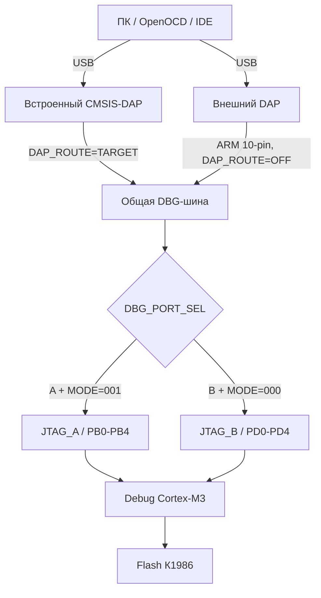

# Замена встроенного ST-Link на CMSIS-DAP в MDR32 MILUINO

## 1. Статус документа

Этот документ описывает предлагаемую переработку встроенного отладчика MDR32 MILUINO для работы с CMSIS-DAP и OpenOCD. Это проектное предложение, а не утверждённая принципиальная схема или готовый нетлист.

Для текущей ревизии приняты следующие исходные решения:

1. микроконтроллер встроенного DAP остаётся существующим STM32F103 (DD2); переход на второй К1986ВЕ92FI отложен на будущую ревизию;
2. карта выводов, коммутация VCP, MODE[2:0], JTAG_A/JTAG_B и локальных функций должны соответствовать актуальному `MDR32_MILUINO_pin_mapping.md`;
3. встроенный CMSIS-DAP работает с target только по SWD; переход с ST-Link на CMSIS-DAP не меняет физический протокол SWD между программатором и К1986ВЕ92FI;
4. JTAG_A/OFF/JTAG_B выбирается согласованной группой из пяти трёхконтактных джамперных селекторов; снятые джамперы образуют состояние OFF;
5. MODE[2:0] задаются только локальными конфигураторами и не выводятся на Morpho;
6. существующий шестиконтактный XP7 и его ST-Link-совместимая распиновка сохраняются для программирования внешних плат на К1986 встроенным DAP;
7. XP8 перерабатывается в пассивный пятиканальный селектор `DAP_ROUTE=EXTERNAL/OFF/TARGET` на гребёнке 3x5 с отдельными джамперами для SWCLK, SWDIO, nRESET, VTref и SWO;
8. стандартный ARM Cortex Debug 10-pin 2x5 с шагом 1,27 мм добавляется как отдельный разъём на общей DBG-шине и не заменяет XP8;
9. полный четырёхпроводный JTAG локального К1986 доступен внешнему отладчику через ARM 10-pin; `nTRST` на этот разъём не выводится;
10. SWO поддерживается от активного порта К1986 через совмещённую линию TDO/SWO и коммутируется пятой строкой XP8;
11. CDC ACM/VCP сохраняется на PD0/PD1 через согласованные пары R108/R208 и R109/R209;
12. встроенный STM32F103 первоначально прошивается и восстанавливается через штатный UART-загрузчик, XP5 и доступ к BOOT0;
13. разъём USB встроенного DAP заменяется на USB-C Device;
14. индикация DAP выполняется по аналогии с STM Nucleo: двухцветный красно-зелёный COM LED и отдельная индикация питания при необходимости;
15. штатный локальный отладочный профиль - `MODE=001`, `DBG_PORT_SEL=A`; после изменения MODE выполняется полный power cycle target.
16. XP7 принимает `EXT_VTREF` от внешней target и не передаёт ей питание; для намеренного питания от программатора используются отдельные контакты `+3V3_DAP_OUT` и GND.
17. поддерживается только внешняя target с номинальным напряжением 3,3 В; наличие VTref определяется дискретной транзисторной схемой, без измерения точного значения АЦП.

До выпуска схемы необходимо совместно утвердить:

1. достаточность Flash/RAM и периферии точной установленной модификации STM32F103 для CMSIS-DAP v2, CDC/VCP, SWO и принятой индикации;
2. конкретные компоненты, номиналы и оставшиеся вопросы защиты питания, VTref и nRESET из отдельного документа [CMSIS_DAP_power_reset_questions.md](CMSIS_DAP_power_reset_questions.md); структурная архитектура источников и доменов питания уже согласована;
3. окончательные номиналы последовательных резисторов, параметры ESD-защиты и допустимую частоту SWD/JTAG по результатам измерений;
4. конфигурацию OpenOCD и работу программирования, восстановления и SWO на реальном К1986ВЕ92FI.

## 2. Термины и границы задачи

CMSIS-DAP и OpenOCD выполняют разные функции:

- **CMSIS-DAP** - протокол и прошивка USB-отладчика на плате;
- **OpenOCD** - программа на компьютере, которая управляет CMSIS-DAP, ядром Cortex-M3 и Flash-памятью К1986ВЕ92FI;
- **К1986ВЕ92FI** - целевой микроконтроллер;
- **DAP MCU** - отдельный микроконтроллер встроенного программатора, в текущей ревизии сохраняемый DD2 семейства STM32F103;
- **VCP** - виртуальный COM-порт между USB и UART целевого МК;
- **VTref** - напряжение целевой стороны 3,3 В, используемое отладчиком для контроля наличия опорного логического уровня. Это не выход питания внешней платы; target с логикой 1,8 В или 2,5 В не поддерживаются;
- **DAP_ROUTE** - переработанный XP8, выбирающий подключение встроенного DAP к XP7, полное отключение либо подключение к локальной DBG-шине;
- **DBG_PORT_SEL** - отдельный пятиканальный селектор локального порта К1986: JTAG_A/OFF/JTAG_B.

Замена ST-Link на OpenOCD не выполняется одной заменой программы на компьютере. На плате должен находиться совместимый USB-адаптер, в данном случае CMSIS-DAP, а OpenOCD должен иметь подходящую конфигурацию target и Flash для К1986ВЕ92FI.

## 3. Исходная реализация

Источники:

- [принципиальная схема ДФТВ.434519.003Э3](../datasheets/ДФТВ.434519.003Э3.pdf), лист 2;
- [паспорт ДФТВ.434519.003ПС](../datasheets/ДФТВ.434519.003ПС.pdf), страницы PDF 8-9;
- [спецификация К1986ВЕ92FI](../datasheets/К1986ВЕ92FI,%20К1986ВЕ92F1I,%20К1986ВЕ94GI.pdf), страницы PDF 74-76, таблицы 12 и 13.

### 3.1. Текущая структура

```text
USB mini-B XS5
      |
      v
STM32F103 DD2 с прошивкой ST-Link
      |
      +---- XP7: выход встроенного ST-Link на внешнюю target-плату
      |
      +---- XP8: две перемычки SWCLK и SWDIO
                    |
                    v
              К1986ВЕ92FI, PD1/PD0, JTAG_B/SWD
```

DD2 одновременно обслуживает:

- USB-интерфейс встроенного ST-Link;
- SWD целевого микроконтроллера;
- UART/VCP;
- светодиод состояния;
- BOOT0 и служебные точки собственного программирования.

### 3.2. XP7

Текущий XP7 - шестиконтактный выход встроенного ST-Link для внешней целевой платы.

| Контакт | Сигнал | Назначение |
|---:|---|---|
| 1 | EXT_VTREF | Опорное напряжение внешней target-платы |
| 2 | SWCLK | Тактовый сигнал SWD |
| 3 | GND | Общий провод |
| 4 | SWDIO | Двунаправленные данные SWD |
| 5 | NRST | Сброс target |
| 6 | SWO | Трассировочный вход встроенного ST-Link |

XP7 не является полноценным JTAG-разъёмом: на нём отсутствуют отдельные TDI, TDO и nTRST. Он также не является безопасным входом внешнего адаптера к установленному К1986ВЕ92FI, потому что остаётся соединён с выходами DD2.

### 3.3. XP8

Текущий XP8 содержит две независимые двухконтактные перемычки.

| Контакты | Соединение |
|---|---|
| 1-2 | `SWCLK` встроенного ST-Link - `SWCLK_TARG` К1986ВЕ92FI |
| 3-4 | `SWDIO` встроенного ST-Link - `SWDIO_TARG` К1986ВЕ92FI |

При замкнутом XP8:

- SWCLK приходит на PD1/JB_TCK, физический вывод 32;
- SWDIO приходит на PD0/JB_TMS, физический вывод 31;
- используется JTAG_B в двухпроводном режиме SWD.

XP8 разрывает только SWCLK и SWDIO. Он не обеспечивает полную изоляцию NRST, SWO, питания и остальных линий JTAG.

### 3.4. Ограничения существующего решения

1. Используется только JTAG_B/SWD на PD0 и PD1.
2. Полный пятисигнальный JTAG к К1986ВЕ92FI не разведён.
3. PD0-PD4 конфликтуют с ADC0-ADC4 и внешней опорой ADC0_REF+/ADC1_REF-.
4. Нет аппаратного выбора JTAG_A/JTAG_B.
5. После снятия XP8 отсутствует полноценный вход внешнего адаптера к установленному target.
6. Подключение внешнего адаптера к XP7 может создать конфликт его выходов с выходами DD2.
7. Нет состояния, в котором все отладочные линии гарантированно электрически отключены от target.
8. Не предусмотрена защита от подпитки выключенного target через отладочные GPIO.
9. MODE[2:0] зафиксированы в `000`, поэтому после включения выбирается JTAG_B.

## 4. Целевая архитектура

### 4.1. Функциональная схема

```text
                         USB-C DAP
                             |
                             v
                   STM32F103, CMSIS-DAP
                     SWD + SWO + VCP
                             |
                    XP8 / DAP_ROUTE 3x5
               EXTERNAL / OFF / TARGET
                    /                   \
                   v                     v
          XP7, 1x6 SWD              общая DBG-шина <---- ARM Cortex Debug 10-pin
          внешняя target                    |
                                      DBG_PORT_SEL
                                      A / OFF / B
                                       /       \
                                      v         v
                              JTAG_A PB0-PB4  JTAG_B PD0-PD4

MODE[2:0] --------------------> отдельный механический конфигуратор
VCP через R208/R209 ----------> PD0/PD1 независимо от DAP_ROUTE
```

Встроенный DAP формирует только SWD и не обязан реализовывать JTAG. Полный четырёхпроводный JTAG доступен внешнему отладчику через дополнительный ARM 10-pin. Этот разъём постоянно подключён к общей DBG-шине перед `DBG_PORT_SEL` и не заменяет XP8.

XP7 используется как выход встроенного DAP на внешнюю target-плату. Вход внешнего DAP к локальному К1986 выполняется через ARM 10-pin, а не через XP7.

### 4.2. Состояния коммутации

| Задача | DAP_ROUTE / XP8 | DBG_PORT_SEL | MODE[2:0] | Разъём |
|---|---|---|---|---|
| Встроенный DAP -> локальный К1986 через JTAG_A/SWD | TARGET | A | 001 | USB-C DAP |
| Встроенный DAP -> локальный К1986 через JTAG_B/SWD | TARGET | B | 000 | USB-C DAP |
| Внешний DAP -> локальный К1986 через JTAG_A | OFF | A | 001 | ARM 10-pin |
| Внешний DAP -> локальный К1986 через JTAG_B | OFF | B | 000 | ARM 10-pin |
| Встроенный DAP -> внешняя target | EXTERNAL | OFF рекомендуется | Не влияет на внешнюю плату | XP7 |
| Полное отключение встроенного DAP и локальных JTAG-ветвей | OFF | OFF | Любое | Разъёмы свободны |

Для внешнего DAP допускаются SWD и обычный четырёхпроводный JTAG. Стандартный ARM 10-pin не содержит nTRST; сброс TAP выполняется последовательностью TMS/TCK, а локальный nTRST остаётся подтянутым к питанию.

Запрещённые сочетания:

- `DAP_ROUTE=TARGET` при подключённом активном внешнем DAP к ARM 10-pin;
- смешанные положения пяти джамперов XP8;
- два джампера в одной строке XP8, соединяющие внешнюю и локальную target;
- `DBG_PORT_SEL=A` вместе с `MODE=000`;
- `DBG_PORT_SEL=B` вместе с `MODE=001`;
- одновременная установка джамперов A и B в одной строке `DBG_PORT_SEL`.

### 4.3. Пути программирования локального К1986ВЕ92FI



Встроенный DAP использует линии SWCLK, SWDIO, nRESET, VTref и вход SWO. Внешний DAP через ARM 10-pin дополнительно использует TDI и TDO для JTAG. Выбранный TDO локального К1986 работает как SWO после перехода интерфейса в SWD.

### 4.4. Программирование внешней target-платы встроенным DAP

```text
ПК -> USB-C -> встроенный CMSIS-DAP -> DAP_ROUTE=EXTERNAL -> XP7 -> внешняя target
```

Для этого:

- все пять джамперов XP8 устанавливаются в положение EXTERNAL;
- SWCLK, SWDIO, nRESET и SWO соединяются только с XP7;
- VTref поступает от внешней target через XP7 только как опорный уровень;
- локальная DBG-шина физически отключена от встроенного DAP;
- питание внешней target через XP7 не подаётся;
- при необходимости внешняя target получает питание через отдельные контакты `+3V3_DAP_OUT` и GND.

### 4.5. Органы переключения на плате

| Орган | Физическое исполнение | Что переключает | Примечание |
|---|---|---|---|
| MODE[2:0] | Три механических 0/1 конфигуратора или джампера | PF4/MODE0, PF5/MODE1, PF6/MODE2 | Новое состояние применяется только после полного power cycle Ucc target |
| DAP_ROUTE / XP8 | Гребёнка 3x5, шаг 2,54 мм, пять джамперов | SWCLK, SWDIO, nRESET, VTref, SWO между XP7, DAP и локальной DBG-шиной | Все пять джамперов устанавливаются одинаково либо снимаются |
| DBG_PORT_SEL | Пять трёхконтактных джамперных селекторов `A-COM-B`; без джамперов - OFF | TCK, TMS/SWDIO, TDI, TDO/SWO и nTRST | Положение должно совпадать с MODE=001/000 |
| SEL_AREF | Механический селектор или мосты | AUcc либо PD0/ADC0_REF+ на Arduino AREF | Для MODE=101 выбрать AUcc |
| SB_REF_MINUS | Normally-open bridge | PD1/ADC1_REF- к AGND | Для MODE=101 обязательно open |
| SEL_D11_SPI_PWM | Существующий селектор PF0/PA1 | PF0 либо PA1 к D11 и ICSP COPI | Для MODE=110 выбрать PA1 либо отключить внешнюю нагрузку PF0 |
| D13/ICSP SCK | Прямая сеть PF1 | PF1 к D13 и ICSP SCK | Для MODE=110 внешние устройства должны быть отключены |

На шелкографии XP8 достаточно подписать столбцы `EXT | DAP | LOCAL` и строки `CLK`, `DIO`, `RST`, `REF`, `SWO`. Полная таблица допустимых положений приводится в документации платы. Джамперы нельзя парковать поперёк строк; при необходимости предусматривается отдельная электрически изолированная парковочная колодка.

## 5. Сохранение DD2 STM32F103

В текущей ревизии существующий DD2 STM32F103 сохраняется и переводится с закрытой прошивки ST-Link на CMSIS-DAP. Переход на второй К1986ВЕ92FI либо другой DAP MCU отложен на будущую ревизию.

До фиксации состава прошивки необходимо определить точную модификацию установленного STM32F103 и подтвердить доступный объём Flash/RAM. Сохраняемый DD2 должен обеспечивать:

- USB Device для CMSIS-DAP v2 и CDC ACM/VCP;
- достаточный объём Flash и RAM для CMSIS-DAP, VCP, SWO и индикации;
- GPIO для SWCLK, двунаправленного SWDIO и управления nRESET;
- вход, пригодный для захвата SWO;
- UART системного загрузчика, выведенный на XP5;
- доступ к BOOT0 и RESET для первичной прошивки и восстановления;
- предсказуемое high-Z состояние отладочных выводов при сбросе и выключенном питании target.

Несмотря на сохранение DD2, его USB-обвязка, питание, тактирование, цепи загрузки и производственного программирования перерабатываются под новую схему. Если точная модификация STM32F103 не вмещает выбранный набор функций, сначала сокращается состав дополнительных функций DAP; замена микроконтроллера относится к отдельной будущей ревизии.

## 6. Требования к прошивке CMSIS-DAP

В прошивке должны быть реализованы:

1. CMSIS-DAP v2 через USB bulk;
2. транспорт SWD и последовательность переключения JTAG -> SWD, необходимая при подключении к К1986ВЕ92FI;
3. управление nRESET;
4. захват SWO от target;
5. CDC ACM/VCP для UART2 target через PD0/PD1;
6. перевод всех отладочных выходов в безопасное состояние при старте, USB disconnect и ошибке;
7. корректное описание возможностей SWD, SWO и UART через команды DAP_Info;
8. уникальный USB serial number;
9. управление индикацией COM по аналогии с STM Nucleo;
10. ограничение начальной частоты SWD до заведомо устойчивого значения.

CMSIS-DAP v1 через HID можно оставить как резерв совместимости, но для OpenOCD основной режим целесообразно строить на CMSIS-DAP v2 bulk.

Полный JTAG во встроенной прошивке не требуется. Он остаётся доступен внешнему отладчику через ARM 10-pin.

### 6.1. Индикация DAP

Функционально воспроизводится индикация ST-LINK/V2-1 на Nucleo:

- медленное мигание красным - запуск до инициализации USB;
- быстрое мигание красным - USB enumeration;
- красный - USB/CMSIS-DAP инициализирован, target ещё не подтверждён;
- зелёный - связь с target установлена либо операция завершена успешно;
- чередование красного и зелёного - обмен с target;
- визуально оранжевый - ошибка.

Используется двухцветный красно-зелёный COM LED с отдельными токоограничивающими резисторами. Номиналы выбираются по яркости конкретного светодиода, а не копируются автоматически со схемы Nucleo. Отдельный `DAP_POWER` допускается как независимый индикатор питания.

## 7. Полная отладочная шина

### 7.1. Обязательные сигналы

| Сеть общей шины | Направление относительно DAP | JTAG_A К1986 | JTAG_B К1986 | Примечание |
|---|---|---|---|---|
| DBG_TCK_SWCLK | DAP -> target | PB2, вывод 45 | PD1, вывод 32 | TCK в JTAG, SWCLK в SWD |
| DBG_TMS_SWDIO | Двунаправленный в SWD | PB1, вывод 44 | PD0, вывод 31 | В JTAG DAP -> target как TMS |
| DBG_TDI | DAP -> target | PB3, вывод 46 | PD3, вывод 34 | Нужен для полного JTAG |
| DBG_TDO_SWO | target -> DAP | PB0, вывод 43 | PD4, вывод 30 | TDO в JTAG, SWO в SWD |
| DBG_nTRST | Внешний JTAG / подтяжка -> target | PB4, вывод 47 | PD2, вывод 33 | На ARM 10-pin не выводится; для штатной работы удерживается неактивным подтяжкой |
| DBG_nRESET | DAP -> target | RESET, вывод 18 | RESET, вывод 18 | Общий для A/B, управление open-drain; от встроенного DAP отключается XP8 |
| DBG_VTREF | target -> DAP | +3V3_TARGET | +3V3_TARGET | Только опорный уровень, не питание target |
| GND | Общий | GND | GND | Несколько контактов на внешнем разъёме |

В режиме SWD активная линия TDO выбранного порта используется как SWO: `PB0/JA_TDO` для JTAG_A либо `PD4/JB_TDO` для JTAG_B. В режиме JTAG та же сеть передаёт TDO и не может одновременно использоваться как SWO.

### 7.2. Подтяжки и последовательные резисторы

Спецификация К1986ВЕ92FI требует подтяжки линий JTAG к питанию сопротивлениями не менее 10 кОм и показывает типовую сеть 100 кОм. Для новой платы принято:

- установить подтяжки 100 кОм к +3,3 В для TMS/SWDIO, TCK/SWCLK, TDI, TDO/SWO и nTRST на общей стороне `DBG_PORT_SEL`, чтобы они действовали только на выбранный JTAG-порт;
- не оставлять постоянные подтяжки на PD0-PD4, когда JTAG_B отключён, поскольку эти выводы используются АЦП и внешней опорой;
- предусмотреть посадочные места последовательных резисторов 22-47 Ом прежде всего на SWCLK/TCK, а при необходимости также на SWDIO, TMS, TDI, TDO/SWO и nRESET;
- окончательные номиналы выбрать после проверки фронтов и устойчивой частоты SWD/JTAG.

Подтяжка RESET должна оставаться на target-стороне независимо от выбранного JTAG-порта.

На пользовательских разъёмах XP7 и ARM 10-pin предусматривается малоёмкостная ESD-защита. Последовательные резисторы используются для согласования фронтов и не заменяют полноценную ESD-защиту.

## 8. Изоляция встроенного DAP

Аппаратная изоляция встроенного DAP выполняется пассивным селектором XP8/DAP_ROUTE. В положении OFF физически разрываются все пять цепей встроенного DAP: SWCLK, SWDIO, nRESET, VTref и SWO. Перевод GPIO STM32 в input не используется как единственное средство отключения.

В положении EXTERNAL эти цепи соединяются только с XP7, а в положении TARGET - только с локальной DBG-шиной. Пассивная коммутация подходит для двунаправленного SWDIO и не добавляет утечку либо паразитную ёмкость электронного mux на аналоговые выводы JTAG_B.

`DAP_nRESET` должен формироваться open-drain либо через отдельный транзистор. Окончательная reset-цепь, её подтяжка и поведение при выключенных доменах утверждаются по чек-листу [CMSIS_DAP_power_reset_questions.md](CMSIS_DAP_power_reset_questions.md).

VTref от внешней и локальной target не соединяются: XP8 выбирает ровно один источник опорного уровня для встроенного DAP. Поддерживается только target с логикой 3,3 В. Номинальное значение внешнего `EXT_VTREF` равно 3,3 В, рабочий ориентир — 3,0...3,6 В. После XP8 выбранный `DAP_VTREF` управляет дискретным транзисторным детектором, формирующим активный низкий сигнал `DAP_VTREF_PRESENT_n` для PA0 DD2; точное измерение напряжения АЦП не требуется. Специальная аппаратная защита от междоменной подпитки не предусматривается; принятый риск и ограничения эксплуатации приведены в [CMSIS_DAP_power_reset_questions.md](CMSIS_DAP_power_reset_questions.md).

## 9. Коммутация JTAG_A/OFF/JTAG_B

Принятая реализация соответствует актуальному `MDR32_MILUINO_pin_mapping.md`: пять общих сигналов TCK, TMS/SWDIO, TDI, TDO/SWO и nTRST проходят через пять одинаковых трёхконтактных джамперных селекторов `A-COM-B`.

Состояния каждого селектора:

- джампер `A-COM` подключает соответствующую линию JTAG_A;
- джампер `COM-B` подключает соответствующую линию JTAG_B;
- снятый джампер образует разрыв.

В штатной эксплуатации все пять джамперов должны находиться в одном согласованном состоянии: A, B либо OFF. Смешанная конфигурация допускается только как специальный диагностический режим. Одновременное соединение одной общей линии с A и B запрещено конструкцией трёхконтактного селектора.

Преимущества принятого варианта:

- отсутствуют утечка и паразитная ёмкость электронного mux на PD0-PD4;
- сохраняется качество аналоговых измерений при отключённом JTAG_B;
- состояние соединений доступно визуальному контролю и измерениям.

Недостаток — необходимость согласованно переставлять пять джамперов. На шелкографии должна быть единая маркировка `A / OFF / B` и сочетания `A+MODE001`, `B+MODE000`.

nRESET и VTref не переключаются между JTAG_A и JTAG_B, поскольку являются общими для локального К1986. Выбор между локальными nRESET/VTref и соответствующими цепями внешней target выполняет отдельный XP8/DAP_ROUTE.

## 10. MODE[2:0]

MODE0, MODE1 и MODE2 находятся соответственно на PF4, PF5 и PF6, физических выводах 6, 7 и 8.

Предлагаемая реализация:

- три независимых механических конфигуратора 0/1;
- определённые внешние pull-down для штатного состояния;
- возможность подать логическую 1 через переключатель и резистор к +3,3 В;
- тестовые точки на всех MODE;
- полная электрическая изоляция PF4-PF6 от Morpho, BOOT0 и внешних GPIO;
- таблица режимов на шелкографии.

Критичные режимы:

| MODE[2:0] | Запуск | Активный JTAG | Последствия |
|---|---|---|---|
| 000 | Внутренняя Flash | JTAG_B | PD0-PD4 заняты отладкой |
| 001 | Внутренняя Flash | JTAG_A | PD0-PD7 доступны аналоговой подсистеме |
| 101 | UART2 loader | Нет JTAG | PD0/PD1 заняты UART-загрузчиком |
| 110 | UART2 loader | Нет JTAG | PF0/PF1 заняты UART-загрузчиком |
| 111 | Тестовый режим | JTAG_A TAP | Не использовать как штатный режим |

Состояние MODE учитывается только при первоначальном включении. После установки FPOR обычного RESET недостаточно: для применения нового положения MODE необходимо полностью отключить основное питание Ucc К1986ВЕ92FI и включить его снова.

Следовательно, на плате нужен доступный способ гарантированно разорвать все источники питания target. Эту функцию выполняет T-образный селектор источника: при снятом джампере его общий выход `+5V_TARGET` отключён от USB target, USB DAP и VIN. Для гарантированного разряда `+3V3_TARGET` предусматривается постоянный параллельный резистор на GND.

Принятый штатный профиль:

- `MODE=001`;
- `DBG_PORT_SEL=A`;
- `DAP_ROUTE=TARGET` для работы встроенным DAP либо `DAP_ROUTE=OFF` для внешнего отладчика.

Он освобождает PD0-PD4 для AREF и аналоговых контактов, но занимает PB0-PB4 интерфейсом JTAG_A.

## 11. Сохраняемый XP7

Форм-фактор, количество контактов и распиновка существующего XP7 сохраняются:

| Контакт | Сигнал | Назначение |
|---:|---|---|
| 1 | EXT_VTREF | Опорное напряжение внешней target-платы |
| 2 | SWCLK | Тактовый сигнал SWD |
| 3 | GND | Общий провод |
| 4 | SWDIO | Двунаправленные данные SWD |
| 5 | nRESET | Сброс target |
| 6 | SWO | Трассировка от target к DAP |

XP7 остаётся шестиконтактным SWD-разъёмом для внешних плат на К1986 без собственного программатора. Выводы TDI и nTRST на него не добавляются; полный четырёхпроводный JTAG через XP7 не поддерживается. Контакт 6 сохраняется как SWO.

При `DAP_ROUTE=EXTERNAL` встроенный CMSIS-DAP программирует внешнюю target по SWD и при необходимости принимает её SWO. При `DAP_ROUTE=TARGET` и `DAP_ROUTE=OFF` XP7 физически отключён от сигнальных цепей встроенного DAP.

`EXT_VTREF` на XP7 используется только как опорный логический уровень от внешней target к встроенному DAP. Питание внешней target-платы через XP7 не предусматривается; для этого используются отдельные контакты `+3V3_DAP_OUT` и GND.

## 12. XP8 и дополнительный ARM 10-pin

### 12.1. Переработанный XP8 / DAP_ROUTE

Текущий четырёхконтактный XP8 заменяется гребёнкой 3x5 с шагом 2,54 мм. Центральный столбец подключён к встроенному DAP, внешние столбцы - к XP7 и локальной DBG-шине.

| Строка | EXT | DAP | LOC |
|---|---|---|---|
| SWCLK | XP7.2 | DAP_SWCLK | DBG_TCK_SWCLK |
| SWDIO | XP7.4 | DAP_SWDIO | DBG_TMS_SWDIO |
| nRESET | XP7.5 | DAP_nRESET | DBG_nRESET |
| VTref | XP7.1 `EXT_VTREF` | DAP_VTREF | LOC_VTREF / DBG_VTREF |
| SWO | XP7.6 | DAP_SWO_RX | DBG_TDO_SWO |

Состояния каждой строки:

- джампер `EXTERNAL-DAP` - работа встроенного DAP с XP7;
- джампер `DAP-TARGET` - работа встроенного DAP с локальной DBG-шиной;
- джампер снят - OFF.

В штатной эксплуатации все пять джамперов находятся в одном положении либо сняты. Смешанные положения и установка двух джамперов в одной строке запрещены. Правильные сочетания приводятся в документации платы; на шелкографии остаются обозначения столбцов и строк.

### 12.2. ARM Cortex Debug 10-pin

На общую DBG-шину добавляется отдельный стандартный разъём ARM Cortex Debug 10-pin 2x5 с шагом 1,27 мм:

| Контакт | Сигнал |
|---:|---|
| 1 | VTref |
| 2 | SWDIO/TMS |
| 3 | GND |
| 4 | SWCLK/TCK |
| 5 | GND |
| 6 | SWO/TDO |
| 7 | KEY/NC |
| 8 | TDI |
| 9 | GNDDetect/GND |
| 10 | nRESET |

Контакты KEY и GNDDetect не переиспользуются под nTRST. Разъём обеспечивает SWD и обычный четырёхпроводный JTAG. Для внешнего отладчика XP8 устанавливается в OFF, затем `DBG_PORT_SEL` и MODE выбирают JTAG_A либо JTAG_B. Ответвление от общей DBG-шины к разъёму должно быть коротким, особенно для TCK/SWCLK.

## 13. USB и питание DAP

### 13.1. USB-C вместо XS5 mini-B

Принят переход с XS5 mini-B на USB-C в роли USB Device. Необходимо:

- отдельные Rd 5,1 кОм на CC1 и CC2;
- ESD-защита D+ и D- с малой ёмкостью;
- посадочные места согласующих последовательных резисторов согласно требованиям выбранного DAP MCU;
- отсутствие длинных ответвлений на D+/D-;
- дифференциальная трассировка около 90 Ом;
- определённая схема подключения экрана разъёма;
- защита VBUS и исключение обратной подачи 5 В.

### 13.2. Домены питания

Структурная архитектура питания согласована; конкретные компоненты, номиналы и защиты выбираются по документу [CMSIS_DAP_power_reset_questions.md](CMSIS_DAP_power_reset_questions.md).

`+3V3_DAP` и `+3V3_TARGET` являются отдельными доменами с общей GND; гальваническая изоляция не предусматривается. DAP получает `+3V3_DAP` от собственного USB-C и может оставаться включённым при полностью выключенном target.

От `+3V3_DAP` предусматривается отдельный защищённый выход `+3V3_DAP_OUT` с контактом GND для намеренного питания внешней target. Этот выход не объединяется с XP7.1 `EXT_VTREF`; внешняя плата возвращает своё фактическое VDD на `EXT_VTREF`. Допустимый ток, ручное разрешение, защита от КЗ и обратного питания должны быть определены до выпуска схемы.

Локальная target питается от одного из трёх источников:

- защищённого VBUS USB-C DAP;
- защищённого VBUS отдельного USB-C target;
- внешнего VIN после отдельного преобразователя в стабильные 5 В.

Один стандартный джампер на четырёхконтактном T-образном селекторе соединяет выбранную ветвь с общим выходом `+5V_TARGET`. Автоматический приоритет отсутствует. Несколько физических источников разрешено подключать одновременно, но невыбранные ветви остаются отключёнными от нагрузки. Без джампера target выключена.

От `+5V_TARGET` единым стабилизатором формируется `+3V3_TARGET`. Контакты `+5V` и `+3V3` Arduino/STMorpho являются только выходами; внешнее питание подаётся только через VIN. Контакты VIN Arduino и STMorpho относятся к одной входной сети.

Для разряда выходных конденсаторов между `+3V3_TARGET` и GND устанавливается постоянный резистор; его номинал определяется после измерения прототипа. Специальные буферы или ключи для гарантированного исключения подпитки через междоменные сигналы не устанавливаются. Сочетание включённого передающего и выключенного принимающего домена является принятым риском и неподдерживаемым режимом эксплуатации. На `+3V3_TARGET` предусматривается отдельный индикатор питания.

Допустимый диапазон VIN, топология и конкретный преобразователь пока не утверждены. `LM2575HVR-5.0` рассмотрен только как кандидат для обычного buck и не является выбранным компонентом.

## 14. VCP и UART-загрузчик

CMSIS-DAP сохраняет CDC ACM VCP. По актуальной карте выводов VCP подключается к UART2 на PD0/PD1 через альтернативные R208/R209. Arduino D0/D1 остаются постоянно подключёнными к UART1 на PB6/PB5 и с VCP электрически не объединяются.

### 14.1. Обычный VCP

Соединения относительно К1986ВЕ92FI:

- `DAP_VCP_TX` -> R208 -> PD0/UART2_RXD, вывод 31;
- PD1/UART2_TXD, вывод 32 -> R209 -> `DAP_VCP_RX`.

R208/R209 являются альтернативами штатным R108/R109, которые подключают PD0/PD1 к Morpho и ветви JTAG_B. Пары переключаются совместно:

- R108/R109 установлены, R208/R209 сняты — PD0/PD1 доступны на Morpho и JTAG_B;
- R108/R109 сняты, R208/R209 установлены — PD0/PD1 подключены к встроенному VCP.

Вторая конфигурация может использоваться как терминал работающей программы либо как физический UART-канал заводского Boot ROM в MODE=101. Она несовместима с JTAG_B и внешней опорой АЦП на PD0/PD1.

### 14.2. Внешний USB-UART для Boot ROM

Оба заводских варианта UART2 доступны для внешнего USB-UART через Morpho либо отдельную сервисную колодку. Вариант MODE=101 дополнительно доступен через встроенный VCP:

| MODE[2:0] | RXD К1986 | TXD К1986 |
|---|---|---|
| 101 | PD0/UART2_RXD, вывод 31 | PD1/UART2_TXD, вывод 32 |
| 110 | PF0/UART2_RXD, вывод 2 | PF1/UART2_TXD, вывод 3 |

Подключение выполняется перекрёстно: TX адаптера -> RXD К1986, RX адаптера <- TXD К1986, GND адаптера -> GND платы. Допустим только USB-UART с логическими уровнями 3,3 В; RS-232 и адаптер с уровнями 5 В подключать нельзя.

Отдельный электронный UART-мультиплексор не требуется: PD0/PD1 выбираются существующими парами R108/R208 и R109/R209. Для удобства можно поставить компактную колодку `GND, +3V3_TARGET, PD0, PD1, PF0, PF1`; вывод `+3V3_TARGET` здесь предназначен прежде всего как опорный уровень, а питание платы от адаптера должно быть явно запрещено либо отдельно защищено от обратного тока.

### 14.3. Загрузчик MODE=101 на PD0/PD1

Требуемое состояние:

```text
MODE[2:0] = 101
DBG_PORT_SEL = OFF
SEL_AREF = AUcc, а не PD0
SB_REF_MINUS = OPEN
```

PD0/PD1 одновременно используются как ADC0_REF+/ADC1_REF-, аналоговые входы и TMS/TCK JTAG_B. Перед загрузкой необходимо отключить PD0 от Arduino AREF, разомкнуть PD1-AGND и установить `DBG_PORT_SEL=OFF`.

Далее выбирается ровно один UART-источник:

- встроенный VCP: снять R108/R109 и установить R208/R209;
- внешний USB-UART 3,3 В на Morpho: установить R108/R109 и снять R208/R209.

После установки MODE нужно полностью выключить и снова включить Ucc target.

Постоянные UART-подтяжки и иные элементы загрузчика на PD0/PD1 ставить не следует: они ухудшат аналоговый режим. Эти выводы также не являются 5-вольт-совместимыми.

### 14.4. Загрузчик MODE=110 на PF0/PF1

Требуемое состояние:

```text
MODE[2:0] = 110
DBG_PORT_SEL = OFF
SEL_D11_SPI_PWM = PA1 либо внешняя нагрузка PF0 отключена
D13/ICSP SCK = без внешней нагрузки
```

| Вывод | UART-загрузчик | Обычная функция платы |
|---|---|---|
| PF0 | UART2_RXD | D11/MOSI, ICSP COPI |
| PF1 | UART2_TXD | D13/SCK, ICSP SCK; локальный LED не подключён |

Перед загрузкой нужно снять shield и внешние устройства с ICSP либо гарантированно исключить их воздействие на PF0/PF1. Для освобождения PF0 можно переключить `SEL_D11_SPI_PWM` с PF0 на PA1. PF1 остаётся прямой сетью D13/ICSP SCK, поэтому внешняя нагрузка на этих разъёмах должна отсутствовать. Затем подключается внешний USB-UART, устанавливается MODE=110 и выполняется полный power cycle Ucc target.

### 14.5. Согласованная архитектура

- встроенный VCP подключается только к PD0/PD1 через R208/R209;
- Arduino D0/D1 остаются на PB6/PB5 UART1 и не переключаются на VCP;
- MODE=101 может использовать встроенный VCP либо внешний USB-UART на Morpho, но только один источник одновременно;
- MODE=110 использует внешний USB-UART на PF0/PF1;
- MODE[2:0] задаётся независимо механическими конфигураторами;
- при UART-загрузке `DBG_PORT_SEL` устанавливается в OFF;
- после любого изменения MODE выполняется полный power cycle основного Ucc target;
- параметры протокола Boot ROM, последовательность обмена и формат загружаемого кода должны быть отдельно подтверждены по спецификации и выбранной утилите.

В инструкции пользователя следует явно привести таблицу состояний MODE и конфликтующих резисторов/селекторов. Встроенный VCP и внешний USB-UART являются только физическими UART-каналами, а не JTAG-программаторами.

### 14.6. Дополнительные функции DAP

- SWO capture включается в состав целевой прошивки: локальный источник приходит с `DBG_TDO_SWO`, внешний - с XP7.6, выбор выполняет пятая строка XP8;
- MCO от DAP MCU на OSC_IN target - через отдельный bridge и только как один из взаимоисключающих источников тактирования;
- USB Mass Storage/DAPLink - не включать без отдельного требования.

## 15. Программирование самого DAP MCU

Первичное программирование и восстановление STM32F103 выполняются через его штатный системный UART-загрузчик и существующий XP5. Для этого сохраняются:

- линии UART программирования на XP5;
- доступ к BOOT0 через существующий конфигуратор XP9 либо эквивалентный узел;
- доступ к RESET DAP MCU;
- возможность полностью перезапустить питание домена `+3V3_DAP`.

XP5 и BOOT0 относятся только к DAP MCU и не смешиваются с XP7, ARM 10-pin, общей DBG-шиной либо UART-загрузчиком целевого К1986. Первичная прошивка должна работать при полностью отключённом target.

## 16. Предлагаемые имена сетей

| Группа | Имена |
|---|---|
| USB DAP | USB_DAP_DP, USB_DAP_DN, USB_DAP_VBUS, USB_DAP_CC1, USB_DAP_CC2 |
| Встроенный DAP | DAP_SWCLK, DAP_SWDIO, DAP_nRESET, DAP_VTREF, DAP_VTREF_PRESENT_n, DAP_SWO_RX |
| Общая шина | DBG_TCK_SWCLK, DBG_TMS_SWDIO, DBG_TDI, DBG_TDO_SWO, DBG_nTRST, DBG_nRESET, DBG_VTREF |
| JTAG_A | JA_TCK, JA_TMS, JA_TDI, JA_TDO_SWO, JA_nTRST |
| JTAG_B | JB_TCK, JB_TMS, JB_TDI, JB_TDO_SWO, JB_nTRST |
| Маршрутизация | DAP_ROUTE_EXTERNAL, DAP_ROUTE_OFF, DAP_ROUTE_TARGET, DBG_SEL_A, DBG_SEL_B, DBG_SEL_OFF |
| Питание | USB_DAP_VBUS, USB_TARGET_VBUS, +5V_DAP_USB, +5V_TARGET_USB, +5V_VIN, +5V_TARGET, +3V3_DAP, +3V3_DAP_OUT, +3V3_TARGET, BUcc, EXT_VTREF, LOC_VTREF, DBG_VTREF |
| Обычный VCP / MODE=101 | DAP_VCP_TX, DAP_VCP_RX, VCP_RX_PD0, VCP_TX_PD1 |
| UART Boot service | UART2_RX_PD0, UART2_TX_PD1, UART2_RX_PF0, UART2_TX_PF1 |
| Программирование DAP MCU | DAP_BOOT_TX, DAP_BOOT_RX, DAP_BOOT0, DAP_RESET |
| Индикация | DAP_COM_LED, DAP_POWER_LED, TARGET_POWER_LED |

Единая терминология уменьшит риск случайного соединения линий DD2 и К1986 при переносе схемы между листами.

## 17. Изменения по узлам существующей платы

| Существующий узел | Предлагаемое изменение |
|---|---|
| DD2 STM32F103 | Сохранить; проверить точную модификацию и ресурсы для CMSIS-DAP v2 + CDC/VCP + SWO + COM LED |
| XS5 mini-B | Заменить на USB-C Device с CC, ESD и защитой VBUS |
| XP7 | Сохранить существующий 1x6 и распиновку как выход встроенного DAP на внешнюю target; XP7.1 переименовать в `EXT_VTREF`, питание через него не передавать |
| Питание внешней target | Добавить отдельные контакты `+3V3_DAP_OUT` и GND; допустимый ток и защиту утвердить вместе с силовой частью DAP |
| XP8 | Заменить пассивным селектором DAP_ROUTE 3x5 для SWCLK, SWDIO, nRESET, VTref и SWO |
| ARM 10-pin | Добавить отдельный стандартный 2x5 1,27 мм на общую DBG-шину для внешнего SWD/JTAG |
| SWCLK/SWDIO DD2 | Подключать к XP7 либо локальной DBG-шине только через XP8 |
| NRST target | Open-drain от DAP; окончательную схему утвердить вместе с питанием |
| XP5 UART / XP9 BOOT0 DD2 | Сохранить для системного UART-загрузчика STM32F103 |
| XP4 питание | Заменить четырёхконтактным T-образным селектором `+5V_DAP_USB / +5V_TARGET_USB / +5V_VIN -> +5V_TARGET`; снятый джампер обеспечивает TARGET OFF |
| XP3/UART | Сохранить или переработать как сервисный header внешнего USB-UART; встроенный VCP подключать только к PD0/PD1 через R208/R209 |
| Индикация ST-Link | Заменить функциональным аналогом Nucleo COM: двухцветный красно-зелёный LED; при необходимости добавить DAP_POWER |
| MODE0-MODE2 | Убрать постоянное `000`; добавить механический конфигуратор и тестовые точки |
| PB0-PB4 | Подключать к общей шине только при выборе JTAG_A; сохранить доступ на Morpho |
| PD0-PD4 | Подключать к общей шине только при выборе JTAG_B; в режиме A не нагружать аналоговые цепи |
| PB5/PB6 UART1 | Постоянно оставить на Arduino D1/D0; к встроенному VCP не подключать |
| PD0/PD1 analog reference | Сохранить SEL_AREF и разрывной SB_REF_MINUS; обеспечить освобождение для MODE=101 |
| PF0/PF1 Arduino/ICSP | Сохранить актуальную карту: PF0 освобождается переключением D11 на PA1, PF1 остаётся прямой сетью D13/ICSP; для MODE=110 внешние нагрузки должны быть отключены |

## 18. Требования к разводке печатной платы

1. USB D+/D- вести парой с постоянной геометрией и непрерывной землёй.
2. ESD-защиту USB разместить у разъёма, последовательные резисторы - согласно рекомендации производителя DAP MCU.
3. XP8, ARM 10-pin и селектор A/B разместить ближе к точке разветвления, не создавать длинных параллельных ответвлений.
4. TCK вести наиболее аккуратно; предусмотреть рядом GND и минимизировать петлю возвратного тока.
5. Не проводить TCK и USB над разрывами опорной земли.
6. Не вести JTAG_B рядом с AREF и высокоомными аналоговыми цепями на большой длине.
7. Разместить тестовые точки на общей шине и на обеих сторонах селекторов.
8. Обеспечить визуальный доступ к положению MODE, DAP_ROUTE и DBG_PORT_SEL.
9. На шелкографии напечатать допустимые сочетания `A+001` и `B+000`.
10. Предупредить: `MODE change -> target power OFF/ON`.
11. У сервисного UART-разъёма ясно обозначить направления RX/TX относительно К1986, разместить рядом GND и маркировку `3V3 ONLY`.
12. Не добавлять на PD0/PD1 постоянные UART-подтяжки и иные элементы, нагружающие чувствительную аналоговую ветвь.
13. Разместить малоёмкостную ESD-защиту непосредственно у XP7 и ARM 10-pin.
14. Предусмотреть опциональные последовательные резисторы 22-47 Ом; SWCLK/TCK считать приоритетной линией для согласования.
15. Ответвление к ARM 10-pin сделать коротким; KEY и GNDDetect не переиспользовать.
16. T-образный селектор питания разместить так, чтобы были однозначно видны положения `DAP`, `USB`, `VIN` и состояние без джампера `OFF`; установка одного стандартного джампера не должна позволять соединить два источника.
17. Силовые входы селектора и общий `+5V_TARGET` трассировать на заявленный максимальный ток; не проводить импульсный узел преобразователя VIN через область USB, VTref и аналоговых цепей.
18. Разместить разрядный резистор и контрольную точку непосредственно на `+3V3_TARGET`, а индикатор питания подключить к этой же целевой шине.

Начальную частоту OpenOCD следует ограничить, затем поднимать после измерения качества сигналов. Максимальную частоту нельзя назначать только по возможностям CMSIS-DAP MCU.

## 19. OpenOCD

Со встроенным CMSIS-DAP OpenOCD использует драйвер `cmsis-dap` и транспорт `swd`:

Минимальный каркас конфигурации:

```tcl
adapter driver cmsis-dap
transport select swd
adapter speed 1000

# Здесь должен подключаться проверенный target-файл К1986ВЕ92FI.
# source [find target/<k1986ve92fi>.cfg]
```

Для внешнего DAP через ARM 10-pin при необходимости доступен JTAG:

```tcl
adapter driver cmsis-dap
transport select jtag
adapter speed 1000
```

OpenOCD поддерживает адаптеры CMSIS-DAP и содержит Flash-драйвер Milandr, но это не гарантирует готовность конкретной board/target-конфигурации К1986ВЕ92FI. До фиксации программной части надо проверить:

- обнаружение TAP/DP;
- правильный IDCODE;
- halt/resume/step;
- управление reset;
- чтение Flash;
- erase/program/verify;
- поведение при защищённой или повреждённой Flash;
- восстановление через JTAG_A и JTAG_B;
- работу на актуальной сборке OpenOCD, используемой в проекте.

Нельзя копировать target-конфигурацию другого Milandr без проверки размеров Flash, адресов контроллера, алгоритма стирания и reset sequence.

## 20. План проверки прототипа

### 20.1. Проверка без К1986ВЕ92FI

1. Проверить все напряжения DAP и отсутствие перегрева.
2. Проверить USB enumeration CMSIS-DAP v2.
3. Проверить уникальный serial number.
4. Проверить обязательный CDC/VCP.
5. Проверить красный, зелёный, чередующийся и аварийный режимы COM LED.
6. Проверить первичную прошивку и восстановление STM32F103 через XP5, BOOT0 и системный UART-загрузчик.
7. Измерить уровни всех отладочных выводов при `DAP_ROUTE=OFF`.

### 20.2. Проверка питания и изоляции

1. Проверить по отдельности питание target от USB-C DAP, USB-C target и VIN.
2. Подключить все три физических источника, проверить каждое положение T-селектора и отсутствие обратного тока в невыбранные ветви.
3. Снять джампер: `+5V_TARGET` и `+3V3_TARGET` должны отключиться, а параллельный резистор должен разрядить `+3V3_TARGET` ниже требуемого порога за измеренное время.
4. Проверить повторное чтение MODE после полного выключения и включения target.
5. Проверить штатный power cycle target при соблюдении документированной последовательности отключения DAP_ROUTE, VCP, внешнего UART и других активных источников сигналов.
6. Измерить остаточное напряжение `+3V3_TARGET` в штатной конфигурации power cycle; произвольные сочетания `DAP ON / target OFF` и `DAP OFF / target ON` не являются критериями приёмки платы.
7. Внешний DAP через ARM 10-pin, `DAP_ROUTE=OFF`: отсутствие конфликта выходов.
8. `DBG_PORT_SEL=OFF`: отсутствие электрической нагрузки на PB0-PB4 и PD0-PD4 в пределах требований.
9. `DAP_ROUTE=EXTERNAL`: локальные nRESET и VTref не должны выходить на XP7.
10. `DAP_ROUTE=TARGET`: VTref внешней платы через XP7 не должен соединяться с локальным `+3V3_TARGET`.
11. Измерить напряжения, пульсации, пусковые токи и нагрев всех стабилизаторов без shield и при максимальной заявленной нагрузке.
12. Проверить короткое замыкание, перегрузку, подключение и отключение каждого разрешённого источника под нагрузкой.
13. При сохранении отдельного питания BUcc проверить отсутствие подпитки основного Ucc и корректный power cycle MODE.

### 20.3. Проверка JTAG_A

1. Установить MODE=001.
2. Выполнить полный power cycle target.
3. Выбрать DBG_PORT_SEL=A.
4. Установить `DAP_ROUTE=TARGET` и проверить встроенный CMSIS-DAP по SWD.
5. Установить `DAP_ROUTE=OFF` и проверить внешний DAP через ARM 10-pin по SWD и JTAG.
6. Начать с 100-500 кГц, затем 1 МГц.
7. Проверить IDCODE, halt, reset, программирование и verify.
8. Проверить, что PD0-PD7 доступны аналоговой подсистеме.

### 20.4. Проверка JTAG_B

1. Установить MODE=000.
2. Выполнить полный power cycle target.
3. Выбрать DBG_PORT_SEL=B.
4. Повторить проверку встроенного SWD и внешних SWD/JTAG.
5. Проверить отладку и Flash.
6. Подтвердить, что аналоговые AREF/A0-A2 считаются недоступными во время отладки.

### 20.5. Проверка аналоговой подсистемы

1. Установить MODE=001 и DBG_PORT_SEL=A либо OFF.
2. Подтвердить физический разрыв всех пяти джамперов ветви JTAG_B.
3. Сравнить шум, смещение и время установления ADC в положениях JTAG_A и OFF.
4. Проверить внешнюю опору ADC0_REF+/ADC1_REF-.
5. Проверить отсутствие влияния общей DBG-шины и XP8 на PD0-PD4 при разомкнутом JTAG_B.

### 20.6. Проверка XP7, XP8 и ARM 10-pin

1. `DAP_ROUTE=EXTERNAL`: встроенный DAP -> XP7 -> внешняя target по SWD.
2. `DAP_ROUTE=TARGET`: встроенный DAP -> локальный JTAG_A/SWD и JTAG_B/SWD.
3. `DAP_ROUTE=OFF`: внешний DAP -> ARM 10-pin -> локальный JTAG_A/JTAG_B.
4. Проверить физический разрыв всех пяти цепей в OFF.
5. Проверить отсутствие питания внешней target через VTref.
6. Проверить отдельный выход `+3V3_DAP_OUT`: допустимую нагрузку, падение напряжения, защиту от КЗ и отсутствие обратного тока от собственного источника внешней target.
7. Проверить, что смешанное положение джамперов обнаруживается по документации и не используется как штатное.
8. Проверить качество TCK/SWCLK с установленными вариантами последовательных резисторов.

### 20.7. Проверка VCP и UART Boot ROM

1. Проверить, что Arduino D0/D1 постоянно работают через PB6/PB5 UART1 и электрически не связаны с VCP.
2. Снять R108/R109, установить R208/R209 и проверить встроенный VCP на PD0/PD1 UART2.
3. Для MODE=101 установить DBG_PORT_SEL=OFF, AREF=AUcc и REF_MINUS open; выполнить полный power cycle и проверить Boot ROM через встроенный VCP.
4. Вернуть R108/R109, снять R208/R209 и повторить MODE=101 через внешний USB-UART 3,3 В на Morpho.
5. После возврата в MODE=001 проверить внешнюю опору и параметры АЦП.
6. Для MODE=110 установить DBG_PORT_SEL=OFF, переключить D11 с PF0 на PA1 либо снять внешнюю нагрузку PF0, освободить D13/ICSP от внешних устройств; подключить внешний USB-UART 3,3 В и выполнить полный power cycle.
7. Проверить обмен с загрузочным ПЗУ через PF0/UART2_RXD и PF1/UART2_TXD.
8. После возврата в рабочий режим проверить D11/MOSI, D13/SCK и ICSP.
9. Проверить документированную последовательность отключения встроенного VCP и внешнего USB-UART перед выключением target; отдельно проверить защиту от ошибочного адаптера с уровнями 5 В.

### 20.8. Проверка SWO

1. В режиме JTAG_A/SWD подтвердить вывод SWO через PB0/JA_TDO.
2. В режиме JTAG_B/SWD подтвердить вывод SWO через PD4/JB_TDO.
3. Проверить захват встроенным DAP при `DAP_ROUTE=TARGET`.
4. Проверить захват от внешней target через XP7 при `DAP_ROUTE=EXTERNAL`.
5. Проверить SWO внешним отладчиком через контакт 6 ARM 10-pin при `DAP_ROUTE=OFF`.
6. Проверить ITM-сообщения, устойчивую скорость и отсутствие переполнения буфера.
7. Подтвердить, что в JTAG эта же линия работает как TDO и одновременно как SWO не используется.

## 21. Какие проблемы решает переработка

| Проблема | Решение |
|---|---|
| Зависимость от закрытого ST-Link | Стандартный CMSIS-DAP и OpenOCD |
| Только двухпроводный JTAG_B/SWD | Встроенный SWD и внешний четырёхпроводный JTAG через ARM 10-pin |
| PD0-PD4 заняты отладкой | Основной режим JTAG_A с MODE=001 |
| Нет выбора JTAG_A/JTAG_B | Пятиканальный A/OFF/B |
| XP7 нельзя безопасно использовать как вход | XP7 остаётся выходом встроенного DAP; для внешнего DAP добавлен ARM 10-pin |
| XP8 разрывает только две линии | DAP_ROUTE 3x5 переключает SWCLK, SWDIO, nRESET, VTref и SWO |
| Конфликт встроенного и внешнего DAP | Физическое положение `DAP_ROUTE=OFF` отключает встроенный DAP |
| Подпитка выключенного target через сигнальные линии | Специальная аппаратная защита не предусматривается; риск принят, сочетание включённого передающего и выключенного принимающего домена не поддерживается |
| MODE жёстко равен 000 | Три механических конфигуратора MODE |
| RESET не применяет новый MODE | Доступный полный power cycle Ucc target |
| mini-B USB | USB-C Device с корректными CC и защитой |
| Нет стандартного входа внешнего JTAG | Дополнительный ARM Cortex Debug 10-pin на общей DBG-шине |
| SWO не коммутируется | Совмещённая сеть TDO/SWO и пятая строка XP8 |
| Неопределённая индикация DAP | Двухцветный COM LED по логике Nucleo |
| Неопределённая связь UART с D0/D1 | D0/D1 постоянно подключены к PB6/PB5 UART1; VCP вынесен на отдельный UART2 PD0/PD1 через R208/R209 |
| Резервная UART-загрузка требует ручного подключения | MODE=101 доступен через встроенный VCP либо внешний USB-UART на PD0/PD1; MODE=110 — через внешний USB-UART на PF0/PF1 |
| PD0/PD1 конфликтуют с внешней опорой в MODE=101 | SEL_AREF, SB_REF_MINUS и запрет постоянных UART-подтяжек на PD |
| PF0/PF1 конфликтуют с Arduino SPI в MODE=110 | PF0 освобождается селектором D11=PA1; shield и внешние устройства ICSP/D13 отключаются, локального LED на PF1 нет |

## 22. Решения, которые ещё нельзя считать утверждёнными

1. Точная модификация сохраняемого STM32F103 и доступные Flash/RAM, UART и USB endpoints должны вместить обязательные CMSIS-DAP v2, CDC/VCP, SWO и индикацию, но решение оставить DD2 в текущей ревизии не меняется.
2. Структурная схема питания и разделение `+3V3_DAP`/`+3V3_TARGET` приняты. Для контроля наличия VTref 3,3 В согласована дискретная транзисторная схема после XP8, а для питания внешней target — отдельные контакты `+3V3_DAP_OUT` и GND. Не утверждены диапазон VIN, токовые бюджеты, конкретные преобразователи, защиты силовых трактов, номиналы и защита детектора VTref, допустимый ток и защита `+3V3_DAP_OUT`, а также окончательная схема nRESET. Аппаратное исключение междоменной подпитки через сигнальные линии не предусматривается; риск принят. Актуальный перечень приведён в [CMSIS_DAP_power_reset_questions.md](CMSIS_DAP_power_reset_questions.md).
3. Конфигурацию OpenOCD и программирование Flash надо подтвердить на реальном К1986ВЕ92FI.
4. Настройку и устойчивую скорость SWO надо подтвердить на реальном К1986ВЕ92FI и сохраняемом STM32F103.
5. Параметры протокола загрузочного ПЗУ для MODE=101/110 надо проверить до реализации утилиты загрузки.
6. Окончательные номиналы последовательных резисторов и состав ESD-защиты выбираются после измерений прототипа.

### 22.1. Отложенный вариант будущей ревизии: второй К1986ВЕ92FI как DAP MCU

Этот вариант не относится к текущей ревизии и не влияет на схему с сохраняемым STM32F103. В будущем вместо DD2 может быть отдельно рассмотрен второй К1986ВЕ92FI. Это не замена корпуса или распиновки: второй МК образует самостоятельный домен `+3V3_DAP`, подключённый к отдельному USB-разъёму как USB Device, и исполняет специально адаптированную прошивку CMSIS-DAP.

Причины, по которым вариант может быть рассмотрен для будущей ревизии DAP:

- ядро Cortex-M3 с тактовой частотой до 80 МГц;
- 128 Кбайт Flash и 32 Кбайт ОЗУ;
- USB FS Device на выводах `DP` (9) и `DN` (10);
- объёма GPIO достаточно для JTAG, RESET, индикации и сервисной прошивки.

Эталонная CMSIS-DAP требует Cortex-M, частоту не менее 48 МГц, SysTick, не менее 16 Кбайт Flash, 8 Кбайт ОЗУ, USB Device и семь GPIO для JTAG/SWD. Аппаратные ресурсы К1986ВЕ92FI этим требованиям соответствуют. При этом готовую прошивку нельзя считать существующей: требуется адаптировать USB-стек, PLL/тактирование USB и GPIO к данному МК, а затем проверить совместимость на реальной плате.

Для возможного будущего прототипа предлагалось сначала включить только CMSIS-DAP v2 и JTAG. VCP и SWO не являются частью пути программирования:

- VCP -- виртуальный COM-порт USB <-> UART работающего target, например для `printf()`;
- SWO -- однопроводный поток трассировки Cortex-M от target к DAP.

Обе функции можно добавить позднее после подтверждения соответствующих цепей, но они не требуются для записи Flash через JTAG.

#### 22.1.1. Предлагаемая GPIO-карта DAP

CMSIS-DAP формирует JTAG программно обычными GPIO; специальный аппаратный JTAG-master во втором МК не нужен. Предлагаемая, но пока не утверждённая карта выводов DAP MCU:

| Вывод DAP MCU | Физический вывод | Сеть | Направление |
|---|---:|---|---|
| PA0 | 63 | `DAP_TCK` | выход |
| PA1 | 62 | `DAP_TMS_SWDIO` | выход в JTAG, двунаправленный в будущем SWD |
| PA2 | 61 | `DAP_TDI` | выход |
| PA3 | 60 | `DAP_TDO` | вход |
| PA4 | 59 | `DAP_nTRST` | выход |
| PA5 | 58 | `DAP_nRESET` | open-drain через внешний транзистор или ключ |

PB0--PB4 второго МК не используются как рабочие линии DAP. Они резервируются для его собственного сервисного JTAG_A: PB0=`TDO`, PB1=`TMS/SWDIO`, PB2=`TCK/SWCLK`, PB3=`TDI`, PB4=`nTRST`.

#### 22.1.2. Штатная прошивка target встроенным DAP

Во время обычной прошивки источник отладочных сигналов один: второй К1986ВЕ92FI. Он принимает команды CMSIS-DAP по USB, программно формирует общую JTAG-шину и передаёт её через `DAP_ISO` к механическому селектору target. Селектор разветвляет единственную общую шину только на одну из групп target:

| Общая сеть DAP | JTAG_A target, `MODE=001` | JTAG_B target, `MODE=000` |
|---|---|---|
| `DBG_TCK` | PB2 | PD1 |
| `DBG_TMS_SWDIO` | PB1 | PD0 |
| `DBG_TDI` | PB3 | PD3 |
| `DBG_TDO_SWO` | PB0 | PD4 |
| `DBG_nTRST` | PB4 | PD2 |
| `DBG_nRESET` | RESET | RESET |

Штатным положением предлагается JTAG_A: `DBG_PORT_SEL=A`, `MODE[2:0]=001`, после установки MODE выполнен полный power cycle target. В этом режиме PD0--PD7 остаются доступны аналоговой подсистеме. JTAG_B является резервным режимом: пользователь выбирает `DBG_PORT_SEL=B`, устанавливает `MODE=000` и полностью перезапускает питание target; PD0--PD4 при этом заняты отладкой.

Прошивка Flash выполняется не самим DAP MCU: OpenOCD или IDE на ПК через USB передаёт CMSIS-DAP команды, обнаруживает TAP target, останавливает ядро, запускает алгоритм стирания/записи Flash и выполняет verify. DAP MCU отвечает только за транспорт USB <-> JTAG и формирование сигнала RESET.

#### 22.1.3. XP7 как сервисный разъём второго МК

Отдельный `DAP_PROG` не требуется, если существующий XP7 через механический селектор умеет переключаться в режим `EXT -> DAP MCU`. В этом режиме внешний SWD-адаптер прошивает или восстанавливает второй К1986ВЕ92FI:

| XP7 | Соединение в режиме `EXT -> DAP MCU` |
|---:|---|
| 1 `VTref` | `+3V3_DAP` только как опорный уровень |
| 2 `SWCLK` | PB2/JTAG_A TCK второго МК |
| 3 `GND` | GND |
| 4 `SWDIO` | PB1/JTAG_A TMS второго МК |
| 5 `nRESET` | RESET второго МК |
| 6 `SWO` | Не требуется для программирования самого DAP MCU; использование определяется схемой будущей ревизии |

Для этой операции второй МК запускается с `MODE=001`; изменение MODE применяется только после полного power cycle `+3V3_DAP`. XP7 несёт лишь SWD, поэтому не может быть разъёмом полного пятисигнального JTAG второго МК, но достаточно для его штатной загрузки и восстановления.

Селектор XP7 должен исключать конфликт источников и иметь как минимум три понятных положения:

1. `EXT -> TARGET`: внешний DAP подключён к отладочной шине target, а встроенный DAP аппаратно изолирован.
2. `EXT -> DAP MCU`: XP7 подключён к PB1/PB2/RESET второго МК, а JTAG target и выход встроенного DAP отключены.
3. `ONBOARD -> XP7`: встроенный DAP программирует внешнюю target-плату; локальный target отсоединён через `DBG_PORT_SEL=OFF`.

Штатная прошивка локального target встроенным DAP не использует XP7. Во всех положениях запрещено одновременное соединение двух активных DAP или двух target-плат.

## 23. Внешние справочные материалы

- [CMSIS-DAP: Overview](https://arm-software.github.io/CMSIS-DAP/latest/index.html)
- [CMSIS-DAP Firmware and hardware requirements](https://arm-software.github.io/CMSIS-DAP/latest/dap_firmware.html)
- [CMSIS-DAP: SWO commands](https://arm-software.github.io/CMSIS-DAP/latest/group__DAP__swo__gr.html)
- [OpenOCD: CMSIS-DAP adapter driver](https://openocd.org/doc-release/doxygen/cmsis__dap_8c.html)
- [OpenOCD official repository](https://github.com/openocd-org/openocd/)
- [Паспорт программатора Миландр с линией TDO/SWO](https://support.milandr.ru/upload/iblock/afc/ve5vfj9v02u10k5hu7cds9ysu42ogcge/%D0%A2%D0%A1%D0%9A%D0%AF.468998.109%D0%9F%D0%A1_1.pdf)
- [STM Nucleo-64 reference manual](../datasheets/Stm%20nucleo%2064%20reference%20manual.pdf), раздел 5.4 и схема ST-LINK/V2-1.
- [OpenOCD configuration-file guidelines](https://openocd.org/doc/html/Config-File-Guidelines.html)
